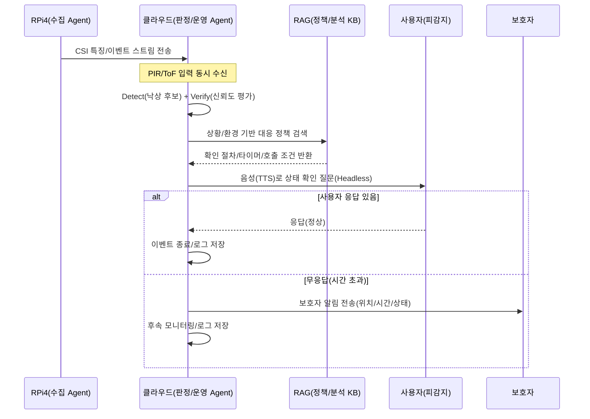

# Wi‑Fi CSI(Channel State Information)기반 사용자 행동 인식 시스템 개발 (feat. 낙상 감지)

# Software Requirements Specification

- Version : 2.0
- Date : 2026.04.03.
- Writer : 종합설계프로젝트2 001분반 7팀

---

# 문서정보 / 수정 내역

| 수정날짜 | 수정자 | 버전 | 추가/수정 항목 | 내용 |
|---|---|---|---|---|
| 2026.03.29 | 김은정, 박소현, 양혜진, 최지원, 황원영 | v1.1 | 1,2,3,4,6,7장 | 용어 통일, 파트별 불일치 내용 수정 |
| 2026.04.03 | 김은정, 박소현, 양혜진, 최지원, 황원영 | v2.0 | 7장 | 챕터 기반에서 requirement id 기반으로 기능 재작성 |

---

## 목차

1. [Introduction](#1-introduction-개요)
2. [Overall Description](#2-overall-description-전체-설명)
3. [Environment](#3-environment-환경)
4. [External Interface Requirments](#4-external-interface-requirements-외부-인터페이스-요구사항)
5. [Performance Requirements](#5-performance-requirements-성능-요구사항)
6. [Non Functional Requirements](#6-non-functional-requirements-기능-이외의-요구사항)
7. [Functional Requirements](#7-functional-requirements-기능요구사항)
8. [Chance Management Process](#8-change-management-process-변경관리-프로세스)
9. [Document Approvals](#9-document-approvals-최종-승인자)
10. [Reference Materials](#10-reference-materials-참고문헌)
11. [Appendix](#11-appendix-부록)

---

# 1 Introduction (개요)

## 1.1 Purpose (목표)

본 Software Requirements Specifications(SRS)의 목적은 Wi-Fi CSI(Channel State Information) 기반 사용자 행동 인식 및 낙상 감지 시스템의 소프트웨어 요구사항을 명확하게 정의하는 데 있다.

이 문서는 시스템의 기능적 요구사항과 비기능적 요구사항을 명확하고 체계적으로 정의함으로써 개발 과정에서 발생할 수 있는 혼선을 줄이고 요구사항의 일관성을 확보하며 프로젝트 이해관계자 간의 공통된 기준을 마련하는 것을 목표로 한다.

본 SRS는 다음과 같은 대상을 위해 작성되었다.

- 시스템을 구현하는 개발자 및 엔지니어(경북대학교 학생)
- 전체 진행을 관리하는 프로젝트 매니저 및 협력 기업 담당자(LG전자)
- 시스템 품질을 검증하는 테스터 및 QA 담당자
- 시스템 설계 및 운영 전략을 수집하는 기획자 및 연구자
- 이 프로젝트를 확인하는 지도교수 및 평가자

본 문서에서 정의하는 소프트웨어는 Wi-Fi CSI 데이터와 PIR/ToF 센서를 활용하여 사용자의 움직임을 분석하고, 낙상 여부를 판단한 뒤 사용자 확인 및 보호자 알림까지 수행하는 통합 시스템이다.

또한, 본 문서는 향후 시스템 개발, 테스트, 배포 및 유지보수 과정에서 기준 문서로 활용되며, 프로젝트의 버전 관리 및 기능 확장 시 참조 기준으로 사용된다.

---

## 1.2 Product Scope (범위)

본 프로젝트에서 개발하는 소프트웨어는 “Wi-Fi CSI 기반 사용자 행동 인식 및 낙상 감지 시스템”이다.

이 시스템은 기존 카메라 기반 감시 시스템의 사생활 침해 문제를 해결하기 위해, 가정 내 Wi-Fi 신호(Channel State Information)와 PIR, ToF 센서를 활용하여 사용자의 움직임을 분석하고 낙상 여부를 판단하는 것을 목적으로 한다.

본 소프트웨어는 사용자의 움직임 데이터를 기반으로 이상 행동(낙상 의심 상황)을 감지하고, 이를 검증한 뒤 사용자에게 음성 안내를 통해 상태를 확인하며, 응답이 없을 경우 보호자에게 알림을 전달하는 기능을 수행한다. 이를 통해 비침습적(Non-intrusive) 방식의 안전 모니터링 환경을 제공하는 것을 목표로 한다.

또한, 본 시스템은 다음과 같은 범위를 포함한다.

- Wi-Fi CSI 및 센서 데이터를 활용한 사용자 행동 분석 및 낙상 감지 기능
- 낙상 의심 이벤트 발생 시 확인(Verification) 및 응답(Response) 처리 흐름
- 사용자 상태 확인을 위한 음성 안내(TTS) 기반 인터페이스
- 보호자에게 상황을 전달하는 알림 시스템(메시지, 푸시 등)

반면, 본 소프트웨어는 다음 범위를 포함하지 않는다.

- 영상(카메라) 기반 사용자 감시 및 분석 기능
- 의료 진단 수준의 정확도를 보장하는 시스템
- 병원 또는 응급 구조 시스템과의 직접적인 연동 기능은 본 프로젝트의 기본 구현 범위에는 포함되지 않으며, 현재는 보호자 알림 중심의 대응 구조를 갖는다.

본 시스템은 고령자 및 1인 가구의 안전 관리 환경에서의 이상 행동 감지 등 다양한 생활 환경에서 활용될 수 있다. 또한, Wi-Fi CSI 기반의 비침습적 센싱 구조를 활용함으로써 카메라 없이도 사용자 상태를 인식할 수 있으며 프라이버시를 고려한 안전 관리 시스템으로 적용 가능하다. 나아가, 향후 서비스 확장을 통해 고령자 및 1인 가구 환경 뿐만 아니라 스마트홈, 산업 환경(공장) 등 다양한 도메인에서도 활용 가능한 구조로 설계된다.

---

## 1.3 Document Conventions (문서규칙)

본 문서는 소프트웨어 요구사항을 명확하고 일관되게 전달하기 위해 다음과 같은 문서 작성 규칙을 따른다.

- 본 문서는 계층적인 구조(장, 절, 항목)를 기반으로 구성되며 각 요구사항은 논리적인 순서에 따라 정리된다.
- 주요 용어 및 기술 용어는 최초 등장 시 전체 명칭과 함께 정의하며, 이후에는 약어를 사용한다.
- 기능적 요구사항과 비기능적 요구사항은 구분하여 작성하며, 각 요구사항은 명확하고 간결한 문장으로 표현한다.
- 요구사항 문장은 “~해야 한다”와 같은 명확한 표현을 사용하여 모호성을 최소화한다.
- 요구사항은 식별 가능하도록 번호 또는 항목 단위로 관리되며, 추적 가능성을 고려하여 작성한다.
- 목록 형태의 항목은 동일한 수준의 중요도를 가지며, 별도의 우선순위는 명시하지 않는다.
- 영문 용어(예: Wi-Fi CSI, PIR, ToF, TTS 등)는 혼동을 방지하기 위해 원문 표기를 병기한다.

---

## 1.4 Terms and Abbreviations (정의 및 약어)

본 문서에서 자주 사용되는 용어에 대한 기본 정의 및 약어를 정리한다.

### 1.4.1 네트워크 및 신호 관련

- Wi-Fi CSI (Channel State Information): 무선 채널의 상태 정보를 나타내며, 신호의 세기와 위상 변화를 통해 사용자 움직임 및 환경 변화를 분석하는 데 활용된다.
- RSSI (Received Signal Strength Indicator): 수신된 무선 신호의 세기를 나타내는 지표로, CSI보다 단순한 신호 강도 기반 정보이다.
- Channel (채널): 무선 통신에서 데이터가 전송되는 주파수 경로를 의미한다.

### 1.4.2 센서 및 인식 기술

- PIR (Passive Infrared Sensor): 적외선을 감지하여 사람의 움직임이나 존재 여부를 판단하는 센서이다.
- ToF (Time of Flight): 빛이 대상에 반사되어 돌아오는 시간을 측정하여 거리 변화를 감지하는 센서 기술이다.
- Multimodal Sensing (멀티모달 센싱): 여러 센서(CSI, PIR, ToF 등)의 데이터를 결합하여 보다 정확한 판단을 수행하는 방식이다.
- Activity Recognition (행동 인식): 사용자의 움직임 패턴을 분석하여 특정 행동을 식별하는 기술이다.

### 1.4.3 시스템 처리 및 구조

- Detect (감지 단계): Wi-Fi CSI 및 센서 데이터를 기반으로 낙상 의심 이벤트를 탐지하는 단계이다.
- Verification (확인 단계): 낙상 의심 이벤트 발생 후 센서 데이터의 신뢰도를 기반으로 실제 낙상 여부를 판단하는 과정이다.
- Response (대응 단계): 낙상으로 판단된 경우 사용자 확인 및 보호자 알림 등 후속 조치를 수행하는 단계이다.
- Event (이벤트): 시스템에서 감지된 특정 상태 변화 또는 행동을 의미한다.
- Edge Computing (엣지 컴퓨팅): 데이터를 클라우드가 아닌 로컬 장치에서 처리하는 방식으로, 지연 감소 및 프라이버시 보호에 유리하다.
- Headless System (헤드리스 시스템): 디스플레이 없이 음성 또는 자동화된 방식으로 동작하는 시스템 구조를 의미한다.

### 1.4.4 인터페이스 및 통신

- TTS (Text-To-Speech): 텍스트 정보를 음성으로 변환하여 사용자에게 안내를 제공하는 기술이다.
- MQTT (Message Queuing Telemetry Transport): 경량 메시지 프로토콜로, IoT 환경에서 장치 간 데이터 통신을 위해 사용된다.
- REST API: HTTP 기반으로 시스템 간 데이터를 주고받는 인터페이스 방식이다.
- Notification (알림): 시스템 이벤트 발생 시 사용자 또는 보호자에게 전달되는 메시지이다.

### 1.4.5 보안 및 특성

- Non-intrusive (비침습적 방식): 사용자에게 직접적인 신체 접촉이나 사생활 침해 없이 데이터를 수집하고 분석하는 방식이다.
- Privacy (프라이버시): 사용자의 개인 정보 및 행동 데이터가 외부에 노출되지 않도록 보호하는 개념이다.

### 1.4.6 도메인 및 기능

- Fall Detection (낙상 감지): 사용자의 움직임 패턴을 분석하여 낙상 여부를 판단하는 기능이다.
- False Positive (오탐): 실제 낙상이 아닌 상황을 낙상으로 잘못 판단하는 경우이다.
- False Negative (미탐): 실제 낙상 상황을 감지하지 못하는 경우이다.
- Confidence (신뢰도): 시스템이 특정 이벤트를 판단하는 데 있어 가지는 확률적 신뢰 수준을 의미한다.

---

## 1.5 Related Documents (관련문서)

본 문서와 관련된 주요 문서는 다음과 같다.

- 프로젝트 제안서
- 시스템[소프트웨어] 요구사항 명세서(SRS)

추후 점차 추가 예정

---

## 1.6 Intended Audience and Reading Suggestions (대상 및 읽는 방법)

본 문서는 다음과 같은 이해관계자를 대상으로 작성되었다.

- 개발자: 시스템 구현을 위한 기능적 및 비기능적 요구사항을 참고한다.
- 프로젝트 관리자: 요구사항을 기반으로 프로젝트 범위 및 일정 관리를 수행한다.
- 협력 기업 담당자(LG전자): 시스템 요구사항의 타당성과 개발 방향을 검토한다.
- 테스터 및 QA 담당자: 요구사항을 기반으로 테스트 케이스를 설계하고 시스템을 검증한다.
- 지도교수 및 평가자: 프로젝트의 완성도와 요구사항 정의의 적절성을 평가한다.

본 문서는 전체 시스템의 이해를 위해 Introduction부터 순차적으로 읽는 것을 권장한다.

이후, 세부 구현과 관련된 내용은 각 요구사항 항목을 중심으로 선택적으로 참고할 수 있다.

개발자 및 테스터는 기능적 요구사항과 비기능적 요구사항 항목을 중점적으로 확인하는 것을 권장한다.

---

## 1.7 Project Output (프로젝트 산출물)

### 1.7.1 Output Format (산출물 형태)

본 프로젝트의 산출물은 Wi-Fi CSI 기반 사용자 행동 인식 및 낙상 감지 기능을 제공하는 엣지 디바이스 기반의 임베디드 시스템 형태로 구성된다.

해당 시스템은 Raspberry Pi와 같은 단일 보드 컴퓨터(SBC)를 기반으로 동작하며, Wi-Fi CSI 및 센서(PIR, ToF) 데이터를 수집·처리하는 모듈과 낙상 이벤트를 판단하고 사용자 및 보호자에게 대응을 수행하는 소프트웨어로 이루어진다.

또한, 본 시스템은 디스플레이 없이 음성 안내(TTS)를 통해 사용자와 상호작용하는 Headless 구조를 따른다.

### 1.7.2 Output Name and Version (산출물명(가칭) 및 버전)

- 산출물명: Wi-Fi CSI 기반 낙상 감지 시스템 (Smart Fall Detection System)
- 버전: v2.0

### 1.7.3 Patent Information (특허 출원 유무 및 내용)

본 프로젝트는 Wi-Fi CSI 기반 신호 분석과 PIR, ToF 센서를 결합한 멀티모달 센싱을 통해 사용자의 행동을 인식하고 낙상을 감지하는 시스템을 포함한다.

특히, Detect–Verify–Response 구조를 기반으로 센서 간 상관관계를 활용하여 낙상 여부를 판단하는 방식과, 카메라를 사용하지 않는 비침습적 행동 인식 구조는 향후 특허 출원이 가능한 아이디어로 고려될 수 있다.

---

# 2 OVERALL DESCRIPTION (전체 설명)

본 프로젝트 산출물의 T0-BE 모습에 대한 전체적인 구성 및 동작, 기능 등에 대해 간략하게 기술한다.
상세한 기능 스펙은 7장에서 기술한다. 

---

## 2.1 PRODUCT PERSPECTIVE (제품 조망)

본 제품은 기존의 카메라 기반 홈 보안 시스템의 고질적인 문제인 사생활 침해를 해결하기 위해 설계된 “비접촉·비침습형 낙상 감지 시스템”이다. 이 시스템은 독립적인 가전 형태나 스마트홈 인프라의 확장 모듈로 동작할 수 있다. 

- 시스템 관계: Wi-Fi 신호(CSI)를 활용하므로 기존 환경 내 Wi-Fi 공유기 인프라를 신호원으로 활용하며, 응급 상황 발생 시 외부 클라우드(Gemini API) 및 메시징 플랫폼(알림톡)과 연동된다. 

- 경쟁력: 기존 가속도계 기반 웨어러블(착용 불편)이나 CCTV(사생활 노출)와 달리, 사용자의 행동 제약이 없고 사생활을 완벽히 보호하면서도 멀티모달 센서 퓨전을 통해 높은 판정 정확도를 제공한다.

---

## 2.2 OVERALL SYSTEM CONFIGURATION (전체 시스템 구성)

본 프로젝트 산출물의 전체 시스템 구성도를 묘사한다. 내부의 관점에서 주요 Component를 도출하고 연관관계를 그린다.
본 시스템은 엣지 노드와 센서부, 그리고 클라우드 AI로 구성된다rl.
- Edge Node (Raspberry Pi 4): 시스템의 메인 컨트롤러로서 모든 데이터의 허브 역할을 수행한다.
- Collector (ESP32 & USB WiFi Dongle): Wi-Fi CSI 데이터를 수집하여 라즈베리 파이로 전달한다.
- Sensor Fusion (PIR & ToF): 물리적 움직임(PIR)과 거리/높이 변화(ToF) 수치를 수집하여 CSI 데이터의 보
조 판정 근거로 활용한다.
- Output Device: 상황 안내를 위한 7인치 HDMI 디스플레이 및 음성 출력을 위한 소형 스피커.
- Cloud AI: 낙상 최종 판정 및 대응 시나리오 생성을 위한 Gemini API 연동부.
- NMP441 마이크: 사용자 음성 응답 확인 및 상황 모니터링용 오디오 입력

---

## 2.3 OVERALL OPERATION (전체 동작방식)

본 프로젝트 산출물의 전체 시스템 구성도를 기준으로 동작 원리 및 시나리오 등을 기술한다.
1. 수집 단계: ESP32와 Wi-Fi 동글이 무선 신호의 CSI 데이터를 추출하고, PIR/ToF 센서가 실시간 거리와 재실 여부를 측정한다.
2. 분석 단계: 라즈베리 파이 내에서 MQTT를 통해 전송된 멀티모달 데이터를 수집하여 전처리한다.
3. 판정 단계: 1차적으로 라즈베리파이 내 낙상 후보 이벤트를 탐지하고, 중요도가 높은 경우 클라우드 AI(Gemini)에 데이터를 전송하여 정밀 추론 및 RAG 기반 정책을 결정한다.
4. 대응 단계:
    1) 피보호자(사용자) 대응: 낙상 후보로 감지된 사용자에게 스피커(TTS)로 "괜찮으신가요?"라는 확인 음성을 송출한다. 사용자가 음성으로 응답하거나 다시 움직임을 보일 경우 시스템은 이벤트를 종료한다.
    2) 관리자(Admin) 대응: 라즈베리 파이에 연결된 7인치 디스플레이를 통해 LLM 분석 전후 데이터(수치 vs 해석 결과), 실시간 센서 로그, 현재 시스템 상태(정상/후보/확정)를 상시 모니터링한다.
    3) 보호자(Guardian) 대응: 사용자가 일정 시간 무응답 시 시스템은 최종 응급 상황으로 확정한다. 이때 사전에 등록된 보호자의 연락망(카카오 알림톡, SMS 등)으로 이벤트 발생 시각과 상황 요약 정보를 포함한 실시간 비상 알림을 발송한다.

---

## 2.4 PRODUCT FUNCTIONS (제품 주요 기능)

- 본 프로젝트 산출물은 사용자의 프라이버시를 보호하면서 낙상을 정밀하게 감지하고 대응하기 위해 다음과 같은 주요 기능을 수행한다. 상세 기능은 제7장(Functional Requirements)의 해당 항목을 참조한다.
- 멀티모달 데이터 수집 및 실시간 전처리 (FR-COL)
    - Wi-Fi CSI 신호와 PIR(움직임), ToF(거리) 센서 데이터를 실시간으로 수집하고 동기화함.
    - 수집된 데이터의 노이즈를 제거(Smoothing)하고 분석 가능한 이벤트 단위로 구조화하여 메시지 기반(MQTT)으로 전달함.
- AI 기반 행동 인식 및 지능형 상황 분석 (FR-ANL)
    - 복합 센서 데이터를 분석하여 이상행동 및 낙상 후보 이벤트를 1차 탐지함.
    - Gemini AI 및 RAG(검색 증강 생성) 기술을 결합하여, 단순 수치 분석을 넘어 운영 정책에 기반한 정밀한 상황 해석과 낙상 확정 기능을 수행함.
- 사용자 상호작용 및 멀티채널 응급 대응 (FR-RSP)
    - Headless UI(음성 안내 및 인식)를 통해 현장 사용자(피보호자)의 상태를 확인하고 응답 여부에 따라 대응 단계를 결정함.
    - 최종 응급 상황 판단 시 보호자에게 실시간 알림(메시지 등)을 전송하여 신속한 구호를 지원함.
- 실시간 시스템 관제 및 관리자 운영 지원 (FR-RSP)
    - 7인치 디스플레이를 통해 실시간 센서 데이터, AI 추론 전/후 데이터 비교, 현재 시스템 상태 및 알림 전송 이력을 관리자에게 시각적으로 제공함.
    - 시스템 장애 감지 및 로그 기록을 통해 운영의 연속성과 재현성을 보장함.

---

## 2.5 USER CLASSES AND CHARACTERISTICS (사용자 계층과 특징)

본 시스템은 사생활 보호와 실시간 감지가 동시에 필요한 다양한 환경에 적용 가능하며, 사용자의 역할에 따라 다
음과 같이 세 계층으로 정의한다.
### 2.5.1. 피보호자 (Safety-vulnerable Groups & General Occupants)
- 정의: 낙상이나 이상행동 감지가 필요한 관찰 대상자로, 고령자뿐만 아니라 환자, 어린이, 혹은 1인 가구
전체를 포함한다.
- 특징:
    - 고령자 및 환자: 거동이 불편하여 낙상 위험이 높고 응급 상황 시 자가 대응이 어려운 계층.
    - 어린이 및 영유아: 보호자의 시야 밖에서 발생할 수 있는 안전사고(가구 전도, 낙상 등)에 노출된 계층.
    - 고위험군 1인 가구: 지병이 있거나 고독사 예방이 필요한 단독 거주자.
- 기대 편익: 카메라에 찍히는 심리적 부담감 없이 24시간 비접촉 안전 모니터링 서비스를 제공받으며, 위급 상황 시 자동화된 인터페이스를 통해 즉각적인 도움을 받음.
### 2.5.2. 보호자 및 현장 관리자 (Primary Responders)
- 정의: 피보호자의 안전 상태를 일차적으로 확인하고 대응하는 주체로, 가족·요양보호사부터 기관 관리자까지 포함한다.
- 특징:
    - 개인형(가족): 스마트폰 앱/메신저 알림을 통해 원격으로 가족의 안부를 확인하고 비상 상황 시 긴급 출동을 결정함.
    - 기관형(병동 간호사/어린이집 교사): 다수의 피보호자를 동시에 관제해야 하는 직군으로, 시스템이 필터링해준 '확정 낙상' 로그를 보고 신속히 현장으로 이동함.
- 기대 편익: 불필요한 단순 움직임 알림은 줄이고, 실제 위급 상황에만 집중할 수 있는 효율적인 관제 환경을 제공받음.
### 2.5.3. 시스템 관리자 및 개발자 (Technical Administrators)
- 정의: 시스템의 안정성을 유지하고 환경 변화에 따른 최적화를 수행하는 기술 인력.
- 특징: Grafana 대시보드 및 시스템 로그를 통해 Wi-Fi 신호의 감도, 센서 오탐률, 네트워크 지연 시간을 상시 모니터링함.
- 주요 임무: 설치 환경(가구 배치, 공유기 위치 등) 변화에 따른 캘리브레이션 수행 및 RAG 기반 대응 정책(런북) 업데이트.

---

## 2.6 ASSUMPTIONS AND DEPENDENCIES (가정과 종속 관계)

본 프로젝트를 수행하기 위해서 필요하거나, 반드시 수행 또는 결정되어야 할 전제조건 또는 선행되어야 할 프로젝트에 대해 기술하며, 그 결과에 따라 본 프로젝트의 어떤 부분에 어떻게 영향을 미칠지를 기술한다. 또한, 통제 불가능한 외부요소에 의해 영향을 받을 수 있는 경우, 그 요소에 대해 기술한다.
- 네트워크 환경: 가정 내 2.4/5GHz Wi-Fi 환경이 구축되어 있어야 하며, 외부 API 연동을 위한 인터넷 접속이 필수적이다.
- 설치 위치: ToF 센서의 정확한 거리 측정을 위해 천장 혹은 벽면의 특정 높이에 고정 설치되어야 함을 전제로 한다.
- 하드웨어 수급: ESP32, 라즈베리 파이 4 등의 부품 수급 및 펌웨어(nexmon_csi) 호환성에 종속된다.

---

## 2.7 APPORTIONING OF REQUIREMENTS (단계별 요구사항)

- Phase 1 (MVP): CSI 및 센서 데이터 수집 파이프라인 구축 및 기본 낙상 감지 로직 구현.
- Phase 2 (고도화): Gemini API 기반 RAG 시스템 연동 및 맞춤형 음성 안내 시스템 구현.
- Phase 3 (확장): 다중 이벤트 감지(장시간 무동작 등) 확장 및 실시간 모니터링 대시보드 완성.

---

## 2.8 BACKWARD COMPATIBILITY (하위 호환성)

신규 개발이 아닌 경우, 기존 산출물과의 호환성을 보장하기 위한 방법 및 Migration 방법을 기술한다.
본 프로젝트는 신규 개발 프로젝트로 기존 제품과의 하위 호환성 이슈는 없으나, 향후 표준 MQTT 프로토콜을 사용하는 타 스마트홈 기기와의 연동 가능성을 고려하여 설계한다.

---

# 3 Environment (환경)

## 3.1 Operating Environment (운영 환경)

본 프로젝트의 산출물을 설치하고 운영하기 위한 하드웨어 환경 정보와 소프트웨어 환경 정보(OS 및 사전에 설치되어야 할 소프트웨어 등)를 기술한다.

### 3.1.1 Hardware Environment (하드웨어 환경)

- 메인 컨트롤러
  - Raspberry Pi 4 (8GB RAM).

- 데이터 수집 기기
  - ESP32 DevKitC WROOM-32D V4 (CSI 수집용 단말).

- 네트워크 인프라
  - Wi-Fi 공유기 (CSI 신호 발생원)
  - ipTIME 무선랜카드(CSI 수집 보조).

- 멀티모달 센서
  - PIR 센서 모듈(재실 감지)
  - ToF 거리 센서(높이 변화 측정)

- 인터페이스 및 출력
  - 7인치 HDMI 디스플레이
  - 소형 스피커(3.5mm)
  - 마이크 모듈(ESP32 호환)
  - 브레드보드(400핀) 및 점퍼 케이블(M/M, M/F)

- 저장 및 전원
  - MicroSD 카드 64GB (Class10 A1)
  - 라즈베리 파이 4 전원공급장치 (WT-5V3A-C)

### 3.1.2 Software Environment (소프트웨어 환경)

#### 3.1.2.1 OS Environment (운영체제 환경)

본 프로젝트의 산출물이 지원하는 OS를 확인하기 위해 전사적으로 최신 OS 목록을 항상 가지고 있어야 한다.

1) Unix/Linux 플랫폼 (Main Controller)

- 주 지원 OS: Raspberry Pi OS 64-bit (Debian Bookworm 기반)
- 커널 버전: Linux Kernel 6.1.y 이상 (Raspberry Pi 4의 BCM2711 SoC 최적화 및 안정성 확보용)
- 아키텍처: ARM64 (AArch64)
- 비고: nexmon_csi 패치 및 커널 빌드가 완료된 특정 커널 릴리즈를 기준으로 지원함

2) 임베디드 플랫폼 (Data Collector)

- 주요 실행 환경: FreeRTOS 기반 ESP-IDF v5.1+ 또는 Arduino Core v3.0+
- 대상 칩셋: ESP32-WROOM-32D (DevKitC V4 CH9102X)
- 통신 스택: 저지연 MQTT 및 REST 통신을 위한 LwIP(Lightweight IP) 지원
- 비고: Wi-Fi CSI Raw 데이터 추출 및 PIR/ToF 센서의 실시간 인터럽트 처리에 최적화된 환경임

#### 3.1.2.2 OS외 software 환경

1) Web Browser

- Mozilla Firefox 최신 버전 (필수 지원: Grafana 등을 활용한 실시간 시스템 운영 지표 시각화 및 대시보드 모니터링용)

2) 통신 및 서버

- Eclipse Mosquitto 버전 2.0 이상 (필수 지원: MQTT 프로토콜 기반의 엣지 기기 간 메시지 버스 및 로컬 브로커 구성용)
- Google Cloud REST API (필수 지원: 엣지 시스템과 클라우드 플랫폼 간의 데이터 송수신 및 클라우드 AI 서비스 연동용)

3) AI 및 언어

- Python 버전 3.10 이상 (필수 지원: 멀티모달 센서 제어, 데이터 전처리 및 전체 에이전트 로직 실행용 메인 언어)
- Google Gemini API 버전 1.5 이상 (필수 지원: 수집된 데이터를 통한 낙상 여부 판정 추론 및 RAG 기반 운영 정책 에이전트 구동용)
- gTTS (Google Text-to-Speech) 라이브러리 (필수 지원: 디스플레이 없는 Headless UI 환경에서의 음성 상태 안내 및 사용자 상태 질문 출력용)

## 3.2 Product Installation and Configuration (제품 설치 및 설정)

본 프로젝트의 산출물의 설치 과정에서의 요구사항을 기술한다. 또한 제품을 실행하는데 필요한 기본 설정 요소 및 방법에 대한 요구사항을 기술한다.

개발 및 설치 담당자는 다음 순서에 따라 환경을 초기화해야 한다.

1. CSI 펌웨어 플래싱:
   - ESP32에 CSI Data Extractor 코드를 업로드하여 공유기와의 통신 세션에서 CSI를 추출하도록 설정한다.

2. RPi 센서 배선 및 I2C 활성화:
   - ToF (VL53L0X): I2C(SDA, SCL) 핀에 연결 후 raspi-config에서 I2C 인터페이스를 활성화한다.
   - PIR: GPIO 핀에 연결하여 인터럽트 방식으로 신호를 수집한다.

3. 드라이버 및 의존성 설치:
   - pip install langchain google-generativeai paho-mqtt gtts 명령을 통해 필수 라이브러리를 설치한다.

4. 시스템 구성 파일(config.yaml) 설정:
   - Gemini API Key, MQTT Broker 주소, 낙상 감지를 위한 거리 임계치, CSI 드리프트 감지 기준선을 입력한다.

## 3.3 Distribution Environment (배포 환경)

### 3.3.1 Master Configuration (마스터 구성)

본 프로젝트의 산출물 마스터를 어떤 형태로 구성할 것인지를 기술한다. 외적인 구성 형태 및 마스터 내부 구성 형태를 미리 고려한다.

- 이미지 배포
  - OS, 드라이버(nexmon_csi 등), 필수 라이브러리가 포함된 전용 SD 카드 이미지(.img) 형태로 구성한다.

- 컨테이너 배포
  - 확장성을 위해 판정 에이전트 및 RAG 모듈은 Docker 컨테이너 이미지로 관리한다.

### 3.3.2 Distribution Method (배포 방법)

본 프로젝트의 산출물 마스터를 어떤 방법으로 배포할 것인지를 기술한다.

예를 들어, CD로 전달한다든지, 소프트웨어를 웹에서 다운로드 받게 한다든지 등의 배포 방법이 있다.

GitHub 리포지토리를 통해 소스 코드 배포 및 패키지 설치 가이드를 제공한다.

민감한 설정값(secrets.py, .env)은 배포 대상에서 제외한다.

### 3.3.3 Patch/Update Method (패치와 업데이트 방법)

배포 이후, 제품 패치와 데이터나 구성 파일 업데이트 등의 업데이트 방법 및 환경을 기술한다.

- 에이전트 업데이트
  - git pull 또는 전용 스크립트를 통해 원격 소프트웨어 패치를 진행한다.

- 지식베이스 업데이트
  - RAG 운영 정책은 클라우드 벡터 DB를 통해 실시간으로 동적 갱신이 가능한다.

## 3.4 Development Environment (개발 환경)

본 프로젝트의 산출물을 개발하기 위한 하드웨어 환경 정보와 소프트웨어 환경 정보를 기술한다.

### 3.4.1 Hardware Environment (하드웨어 환경)

- 개발용 PC (Windows/macOS/Linux) 및 테스트용 Raspberry Pi 4 세트.
- ESP32 개발 환경 연동을 위한 시리얼 통신 케이블.

### 3.4.2 Software Environment (소프트웨어 환경)

- IDE: Visual Studio Code (Python, C++ 확장 도구 포함).
- 버전 관리: Git, LangChain 프레임워크, Google Cloud SDK.

## 3.5 Test Environment (테스트 환경)

본 프로젝트의 산출물을 설치하고 테스트하기 위한 하드웨어 환경 정보와 소프트웨어 환경 정보(OS 및 사전에 설치되어야 할 소프트웨어 등)를 기술한다.

### 3.5.1 Hardware Environment (하드웨어 환경)

- 실제 거주 환경과 유사한 Wi-Fi 신호 간섭이 존재하는 테스트 벤치.
  - 가로 4m, 세로 4m 이상의 거실 환경을 모사한 테스트 벤치를 구축한다.

- 스니핑 전용 무선 랜카드: 데이터 패킷 캡처를 위해 모니터 모드(Monitor Mode)를 지원하는 ipTIME 무선랜카드를 테스트 장비에 추가로 연결한다.

- 측정용 워크스테이션: 로그 분석 및 실시간 패킷 모니터링을 위한 별도의 노트북 또는 PC를 배치한다.

### 3.5.2 Software Environment (소프트웨어 환경)

- 성능 평가 도구: 오탐률(False Positive) 및 미탐률(False Negative) 측정을 위한 데이터 라벨링 툴과 시나리오별 자동화 평가 스크립트를 운용한다.
- 지연 시간 로거(Latency Logger): 수집-추론-알림 각 단계의 타임스탬프를 기록하여 End-to-End 지연 시간을 계산하는 Custom Python 스크립트를 구동한다.
- 패킷 스니퍼(Packet Sniffer): 네트워크 패킷을 실시간으로 가로채 분석하기 위해 Wireshark 또는 tcpdump 툴을 설치하여 운용한다.
- 운영 모니터링: 수집된 하드웨어 및 소프트웨어 로그를 시각화하기 위해 InfluxDB와 Grafana 대시보드를 구성한다.

## 3.6 Configuration Management (형상관리)

### 3.6.1 Location of Outputs (산출물 위치)

형상관리 서버상의 본 프로젝트의 소스 위치 및 문서 위치를 명시한다.

Location of Source Code (소스코드 위치)

https://github.com/cse-project2-lg

Location of Documents (문서 위치)

https://github.com/cse-project2-lg

### 3.6.2 Build Environment (빌드 환경)

빌드머신 등의 빌드 환경을 어떻게 구축/운영할지 Build/Release 팀과 협의하여 기술한다.

빌드 기계, 빌드 디렉터리, 특수하게 요구되는 빌드방법 등을 기술한다.

본 프로젝트는 코드의 품질 유지와 배포 자동화를 위해 GitHub Actions 기반의 CI/CD 환경을 구축하여 운영한다.

- 빌드 기계 (Build Machine): GitHub에서 제공하는 가상 환경인 GitHub-hosted Runners (Ubuntu-latest)를 사용한다. 이는 최신 리눅스 커널과 Python 3.10 이상의 런타임 환경을 제공하여 엣지 기기(Raspberry Pi)와 유사한 빌드 환경을 보장한다.

- 빌드 디렉터리 (Build Directory): GitHub Actions 작업 시 자동으로 할당되는 워크스페이스인 { github.workspace }를 기본 빌드 경로로 사용한다. 모든 소스 코드와 라이브러리 의존성은 해당 디렉터리 내에서 격리되어 빌드된다.

- 빌드 및 운영 방법:
  - 트리거: main 및 develop 브랜치에 소스 코드가 push 되거나 Pull Request가 발생할 때 자동으로 빌드 파이프라인이 시작된다.
  - 의존성 관리: requirements.txt에 명시된 필수 라이브러리(LangChain, Google Generative AI 등)를 자동으로 설치한다.
  - 검증 절차: 빌드 과정 중 PyLint를 통한 코드 정적 분석과 PyTest를 활용한 단위 테스트를 수행하여 로직의 결함을 사전에 차단한다.
  - 산출물 생성: 테스트 완료 후, 라즈베리 파이 4 및 클라우드 환경에서 즉시 실행 가능한 Docker 컨테이너 이미지를 빌드하여 레지스트리에 저장한다.

## 3.7 Bugtrack System (버그트래킹)

이 제품의 유지보수를 위해 사용할 버그트래킹 시스템과 버그트래킹에서 사용될 제품이름을 명시한다.

- 시스템: GitHub Issues를 활용하여 버그 리포팅 및 작업 상태를 관리한다.
- 관리 대상: 시스템 기능 결함, 센서 신뢰도 이슈, RAG 응답 정확도 등.

## 3.8 Other Environment (기타 환경)

개인정보 보호: 프라이버시 강화를 위해 민감한 생성 데이터는 로컬 우선으로 처리하며, 외부 클라우드 전송 시에는 비식별화된 특징점 데이터만 전송하도록 설계한다.

---

# 4 External Interface Requirements (외부 인터페이스 요구사항)

## 4.1 System Interfaces (시스템 인터페이스)

본 시스템은 다양한 하드웨어 및 소프트웨어 구성 요소와 상호작용하기 위해 다음과 같은 시스템 인터페이스를 제공한다.

1) Wi-Fi 네트워크 기반 CSI 수집 인터페이스
본 시스템은 Wi-Fi 네트워크 환경에서 채널 상태 정보(Channel State Information, CSI)를 수집하기 위한 인터페이스를 가진다. 수집된 CSI 데이터는 사용자의 움직임 및 행동 변화를 분석하는 기초 데이터로 활용된다. 해당 인터페이스는 네트워크 인터페이스 카드(NIC) 및 CSI 수집 도구를 통해 구현되며, 실시간 데이터 수집 및 전처리를 지원한다.

2) 메시지 브로커 인터페이스 (MQTT)
본 시스템은 각 모듈 간 센서 데이터와 이벤트 정보를 전달하기 위해 MQTT 기반 메시지 브로커와 인터페이스를 가진다. 이를 통해 Wi-Fi CSI 데이터, PIR 및 ToF 센서 데이터, 낙상 의심 이벤트 정보가 publish/subscribe(Pub/Sub) 방식으로 전달되며, 시스템 구성 요소 간의 느슨한 결합과 실시간 데이터 처리를 지원한다.

3) 클라우드 플랫폼 인터페이스 (GCP)
본 시스템은 데이터 저장, 처리 및 서비스 확장을 위해 Google Cloud Platform(GCP)과 인터페이스를 가진다. GCP는 클라우드 기반의 컴퓨팅 자원 및 데이터 처리 환경을 제공하며, 엣지 디바이스에서 수집된 데이터를 저장하거나 추가 분석 및 서비스 운영에 활용될 수 있도록 지원한다.

4) AI 분석 서비스 인터페이스 (Gemini API)
본 시스템은 낙상 이벤트 분석 및 운영 지원 기능을 위해 Gemini API와 인터페이스를 가진다. Gemini API는 수집된 센서 데이터와 이벤트 정보를 기반으로 상황 해석, 추가 분석 및 운영 지식 기반 응답 생성에 활용될 수 있으며, HTTP 기반 API 호출 방식으로 연동된다.

5) 외부 알림 서비스 인터페이스
본 시스템은 낙상 발생 후 사용자 응답이 없을 경우 보호자에게 상황을 전달하기 위해 외부 알림 서비스와 인터페이스를 가진다. 해당 인터페이스는 REST API 기반 메시지 전송 방식을 사용하며, 문자 메시지, 메신저, 푸시 알림 등 다양한 수단을 통해 보호자에게 이벤트 정보를 전달한다.

---

## 4.2 User Interfaces (사용자 인터페이스)

본 시스템은 고령자 및 1인 가구를 주 대상으로 하므로, 복잡한 조작을 최소화하고 직관적인 정보 전달에 초점을 맞춘 Headless UI 모델을 채택한다.

### 4.2.1 GUI 설계 원칙 및 레이아웃 제약 (Screen Layout Constraints)

7인치 HDMI 디스플레이(1024x600 해상도 권장)를 기준으로 다음과 같은 표준을 따른다.
- 상태 표시줄 (Status Bar): 화면 상단에 항시 표시되며 Wi-Fi 연결 상태, 센서(CSI, PIR, ToF) 활성화 여부, 현재 시간을 노출한다.
- 중앙 모니터링 영역: 실시간 움직임 감지 상태를 단순화된 애니메이션이나 게이지 형태로 표시하여 시스템이 정상 동작 중임을 알린다.
- 에러 메시지 표준: 시스템 장애(센서 연결 끊김 등) 발생 시, 화면 하단에 붉은색 알림바와 함께 직관적인 아이콘을 표시한다.
- 사용자의 음성 응답을 기반으로 상태를 확인할 수 있다.

### 4.2.2 음성 인터페이스 (VUI: Voice User Interface)
본 제품은 버튼 없는 운영 흐름(Headless UI)을 지향하므로 스피커를 통한 음성 인터페이스가 핵심적인 역할을 한다.
- 음성 안내 (TTS): gTTS를 활용하여 부드럽고 명확한 한국어 음성으로 안내한다.
    - 상황 1 ( 낙상 의심 ) : "사용자님, 몸 상태가 괜찮으신가요? 응답이 없으시면 보호자에게 연락합니다."
    - 상황 2 ( 알림 발송 ) : "보호자에게 낙상 위험 알림을 전송하였습니다."
- 음성 인식: 마이크를 통해 사용자의 "도와줘" 또는 "괜찮아"라는 음성 명령을 인식하여 이벤트를 취소하거나 확정한다.

### 4.2.3 하드웨어 인터페이스 연동 (Hardware Interaction)
- 스피커 연동: 모든 알림은 스피커의 사운드 효과(Beep) 또는 TTS 안내와 동기화되어 출력되어야 한다.
- 터치 피드백: 7인치 디스플레이의 터치 입력을 지원하며, 버튼 클릭 시 시각적 변화(색상 반전 등)를 통해 입력 성공 여부를 알린다.

---

## 4.3 Hardware Interfaces (하드웨어 인터페이스)

### 4.3.1 주요 하드웨어 컴포넌트 인터페이스 명세
1) PIR 센서 모듈
    - 목적: 사용자의 공간 내 재실 유무 및 즉각적인 움직임 1차 감지
    - 통신 방식: GPIO (General Purpose Input/Output) 디지털 통신
    - 데이터 Input: 센서 렌즈를 통해 감지되는 인체의 적외선 열 변화 (물리적 아날로그 신호)
    - 데이터 Output: High(1, 움직임 있음) 또는 Low(0, 움직임 없음) 상태의 디지털 전기 신호
    - 상호작용: 소프트웨어는 리소스 낭비를 막기 위해 지속적으로 상태를 묻는 폴링(Polling) 방식 대신, 상태가 변할 때만 하드웨어 인터럽트(Interrupt)를 발생시키도록 설정하여 RPi4/ESP32가 즉각적으로 이벤트를 수신하고 타임스탬프를 기록
2) ToF 거리 센서
    - 목적: 바닥 또는 천장과의 거리 변화를 정밀 측정하여, 낙상 시 발생하는 급격한 높이 하락 패턴을 감지
    - 통신 방식: I2C (Inter-Integrated Circuit) 직렬 통신 버스
    - 데이터 Input: 물체에 반사되어 돌아오는 레이저 펄스의 비행 시간
    - 데이터 Output: 밀리미터(mm) 단위의 거리 측정값 (디지털 데이터 형태)
    - 상호작용: 소프트웨어는 지정된 샘플링 주기(예: 10Hz~50Hz)마다 I2C 버스의 특정 레지스터 주소(SDA/SCL 핀)에 접근하여 거리 값을 지속적으로 읽어 들임.
3) ESP32 개발보드 (보조 센서 수집 및 트래픽 송신기)
    - 목적: RPi4의 연산 부하를 줄이기 위해 PIR과 ToF 등 물리적 센서의 Raw data를 1차적으로 취합하는 동시에, RPi4가 무선 전파 파동(CSI)을 원활하게 캡처할 수 있도록 공유기(AP)를 향해 지속적인 Ping 트래픽을 유발하는 송신기 역할을 수행
    - 통신 방식: UART / Serial 직렬 통신 (RPi4 센서 데이터 전달용) 및 802.11 b/g/n 무선 네트워크 (AP
    Ping 전송용)
    - 데이터 Input: PIR 및 ToF 센서로부터 수집된 물리적 상태 변화 신호 (디지털/I2C)
    - 데이터 Output: 정형화된 JSON 형태의 문자열 패킷(디바이스 id, 시간스탬프, 센서 값 등) 및 공유기(AP)로 지속 송출되는 무선 ICMP Ping Request 패킷
    - 상호작용: 백그라운드에서 공유기(AP)로 고빈도의 Ping 패킷을 지속 전송하여 허공에 표준 WiFi 프레임을 고의로 발생, 이와 병행하여 유선 센서(PIR, ToF) 데이터를 파싱한 후 RPi4의 시리얼 포트로 끊임없이 스트리밍 송신
4) 무선 네트워크 통신 (내장 Wi-Fi & USB Wi-Fi 동글)
    - 목적: 내부망에서 발생하는 CSI 데이터 획득(내장 Wi-Fi)과 외부 클라우드망(GCP)과의 AI 통신(동글) 역할을 물리적/논리적으로 완전히 분리하여 네트워크 병목과 통신 간섭을 차단
    - 통신 방식: 802.11 b/g/n/ac 무선 랜 프로토콜, TCP/IP 기반 MQTT/REST
    - 데이터 Input: (내장 Wi-Fi) ESP32와 AP 간에 오가는 Ping/Pong 무선 패킷 트래픽 / (동글) 클라우드 AI에서 내려오는 판정 응답 및 제어 명령
    - 데이터 Output: (내장 Wi-Fi) 추출된 헥스(Hex) 형태의 원시 CSI 매트릭스 / (동글) RPi4에서 전처리 및 압축 완료된 CSI 특징 벡터와 센서 이벤트 로그
    - 상호작용: 라즈베리파이의 내장 Wi-Fi 인터페이스(예: wlan0)는 Nexmon CSI 펌웨어 패치를 적용하여 수신기(Receiver, Rx)로 작동하며 ESP32가 유발한 허공의 패킷을 스니핑하여 CSI 데이터를 추출함, 이와 동시에 물리적으로 독립된 USB Wi-Fi 동글(wlan1)은 일반 클라이언트 모드로 작동하여 클라우드 서버와 TLS/SSL 암호화 기반의 안전한 양방향 통신 세션을 유지함.
5) 클라우드 LLM 기반 데이터 추론 통신
    - 목적: RPi4의 1차 필터링(Rule-based)을 통과한 유의미한 이상 데이터만 클라우드 LLM으로 전달하여, 네트워크 비용을 최소화하고 정밀한 상황 추론을 수행
    - 통신 방식: HTTPS / REST API 호출
    - 데이터 Input: 클라우드 LLM이 분석을 마치고 반환한 상황 요약 텍스트 및 최종 낙상 여부 판정 결과 (JSON)
    - 데이터 Output: 로컬 Rule을 위반한 특정 시점의 센서 변화량 조각과 상황 분석을 요청하는 텍스트 프롬프트
    - 상호작용: 모든 실시간 센서 데이터를 클라우드에 전송하지 않고 RPi4 내부의 룰 엔진이 '특정 이상 패턴'을 감지했을 때만 해당 시점 전후의 압축된 데이터를 선별함. 선별된 데이터는 LLM이 이해할 수 있는 프롬프트 형태로 패키징되어 외부 클라우드망으로 전송되며, LLM은 이를 기반으로 복합적인 상황을 추론(예: "단순히 물건을 떨어뜨린 것인지, 실제 사람이 넘어진 것인지" 구분)하여 최종 결과를 RPi4로 반환함.
6) 사용자 피드백 장치 (음성 상호작용)
    - 목적: '낙상 후보' 상황 발생 시 사용자의 의식 상태를 확인하여 실제 위급 상황 여부를 판별하고, 결과에 따라 보호자 알림을 제어
    - 통신 방식: 아날로그 오디오 입/출력 (스피커 출력 및 마이크 입력)
    - 데이터 Input: 클라우드/로컬에서 생성된 상태 확인용 TTS 오디오, 사용자의 음성 응답 (STT 변환)
    - 데이터 Output: 사용자에게 송출되는 물리적 질의 음파 ("괜찮으신가요?"), 보호자 알림(Push/SMS) 트리거 신호
    - 상호작용: RPi4의 로컬 룰에 의해 '낙상 후보'로 1차 판정되면, 스피커를 통해 사용자에게 상태를 묻는 음성을 송출함. 일정 시간(예: 10초) 내에 마이크를 통해 사용자의 "괜찮다"는 정상 응답이 인식되면 오경보로 처리하여 알림을 취소함. 반대로 무응답이거나 신음 등 비정상 상황으로 인식될 경우, 즉각 보호자에게 알림을 전송함.
7) 관리자 모니터링 시스템 (디스플레이)
    - 목적: 시스템의 가동 상태와 데이터 흐름, 이벤트 로그를 관리자가 즉각적으로 파악할 수 있도록 실시간 시각화 제공
    - 통신 방식: 화면 출력 (HDMI/DSI 등 비디오 인터페이스)
    - 데이터 Input: RPi4 로컬 판정 상태, 센서 데이터 스트림, LLM 추론 전/후 데이터, 보호자 알림 발송 내역
    - 데이터 Output: 렌더링 된 대시보드 UI 화면 (단방향 출력)
    - 상호작용: 현재 시스템에서 발생하고 있는 모든 현황을 실시간으로 보여줌.
    - 현 상태 UI: 각각의 3가지 상태(행동상태/대응상태/알림상태)를 직관적인 색상과 텍스트로 표출
    - 데이터 흐름: 획득된 원시 데이터가 LLM을 거쳐 어떻게 해석되었는지 '전/후 비교' 형태로 시각화
    - 시스템 로그: 타임스탬프 기준의 센서 변화 이력, 판정 결과, 보호자(수신자) 정보 및 알림 전송 성공 여부를 리스트 형태로 출력

### 4.3.2 ToF Sensor Interface

전체 시스템 내에서 하드웨어와 소프트웨어가 데이터를 주고받는 'Detect-Verify-Respond' 물리적 흐름은 다음과 같은 5단계 사이클로 이루어진다.
1) 물리적 환경 감지 (Sensing): 방 안의 Wi-Fi 공유기(AP)가 지속적으로 전파를 쏘고, 사용자의 움직임이 PIR 렌즈와 ToF 레이저, 그리고 Wi-Fi 전파(CSI)에 물리적인 간섭을 일으킨다.
2) 엣지 1차 수집 (Data Aggregation): ESP32는 PIR과 ToF의 아날로그/디지털 변화를 읽어 USB 시리얼 케이블을 통해 라즈베리파이(RPi4)로 전송한다. 동시에 RPi4의 내장 Wi-Fi 칩셋은 AP 전파에서 CSI 데이터를 캡처한다.
3) 엣지 전처리 및 클라우드 송신 (Processing & Tx): RPi4의 소프트웨어(수집 에이전트)가 세 가지 센서 데이터를 하나로 동기화(Sync)하고 노이즈를 필터링한 뒤, USB Wi-Fi 동글을 통해 구글 클라우드(GCP)로 가벼운 데이터 페이로드(Payload)를 송신한다.
4) 클라우드 판정 및 응답 수신 (AI Inference & Rx): 클라우드의 Gemini API 및 RAG 에이전트가 낙상 여부를 판정한 뒤, 현장 확인이 필요할 경우 "괜찮으신가요?"라는 TTS 음성 파일(또는 텍스트)과 제어 명령을 RPi4의 USB Wi-
Fi 동글로 내려보낸다.
5) 현장 출력 및 모니터링 (Action & Display): 명령을 수신한 RPi4는 소형 스피커로 음성을 즉각 송출하여 사용자의 응답을 유도한다. 이 모든 데이터의 흐름과 기기별 정상 작동 여부는 7인치 HDMI 디스플레이(관리자 대시보드)
에 실시간으로 그려진다.

---

## 4.4 Software Interfaces (소프트웨어 인터페이스)
본 시스템은 엣지(Edge) 기기에서 수집된 멀티모달 데이터를 클라우드 기반 AI 모델(Gemini)과 연동하여 분석하는 하이브리드 아키텍처를 가진다. 주요 소프트웨어 컴포넌트 간의 연결 방식과 데이터 명세는 다음과 같다.

### 4.4.1 Gemini API Interface

### 4.4.1 외부 컴포넌트 및 라이브러리 연동 상세

| 소프트웨어 컴포넌트 (명칭 및 버전) | 연결 방식 (Interface) | 데이터 유입 (Data In) | 데이터 유출 (Data Out) | 주요 목적 |
|---|---|---|---|---|
| Google Gemini API (v1.5 Flash 이상) | REST API / HTTPS | 전처리된 CSI 특징점, 센서 이벤트 로그, 시스템 프롬프트 | 낙상 판정 결과(JSON), TTS용 확인 문구, 운영 정책 | 멀티모달 데이터를 통합 분석하여 낙상 여부를 최종 판정하고 대응 로직 생성 |
| nexmon_csi (Latest v2.x) | Firmware Wrapper | Wi-Fi 공유기 발송 무선 신호(L1/L2 레이어) | Raw CSI Matrix (채널 상태 정보 데이터 스트림) | Wi-Fi 신호로부터 사람의 움직임에 따른 채널 변화 데이터를 추출 |
| LangChain (v0.1 이상) | Python SDK | 사용자 런북(Runbook), 환경 프로파일, 에이전트 쿼리 | 검색된 지식 기반의 증강된 프롬프트 (Augmented Prompt) | RAG(검색 증강 생성) 로직을 통해 환경 변화에 따른 운영 의사결정을 자동화 |
| Eclipse Mosquitto (v2.x) | MQTT Protocol | ESP32 수집 데이터, 센서 상태 값(PIR/ToF) | 통합 메시지 버스 데이터 스트림 | 엣지 기기 간의 저지연 메시징 버스를 구성하여 실시간 데이터 연동 |
| gTTS (Google Text-to-Speech) | Python Library | Gemini가 생성한 상태 확인 질문 텍스트 | 오디오 신호 (Audio Stream/File) | Headless UI 구현을 위해 사용자에게 음성으로 상태를 확인 |
| Chroma / Pinecone (Vector DB) | API / Client | 상황별 대응 정책, 과거 운영 로그 (Embedding) | 검색된 관련 지식 문서 (Documents) | 환경 변화(드리프트) 대응을 위한 지식베이스 저장 및 고속 검색 |
| Notification API (Kakao/SMS) | HTTP REST | 보호자 비상 연락처, 사고 발생 위치/시간 정보 | 푸시 알림 / 문자 메시지 | 사용자가 음성 확인에 무응답 시 보호자에게 즉시 알람 전송 |

### 데이터 항목별 목적 및 흐름 설명
- CSI 특징/이벤트 스트림: Wi-Fi 신호에서 추출된 움직임 패턴 데이터를 포함하며, 낙상 후보 이벤트를 생성하는 핵심 입력값이다.
- 센서 동시 수신 데이터 (PIR/ToF): 물리적인 재실 유무와 높이/거리 변화 값을 수신하여 Wi-Fi 데이터의 오탐을 줄이는 검증(Verify) 데이터로 활용된다.
- 상황별 대응 정책 및 런북: 시스템이 "낙상"으로 판단한 후, 시간대나 환경에 따라 "바로 신고할지" 또는 "음성 질문을 먼저 할지" 등의 운영 로직을 결정하는 지식 소스이다.
- 사용자 응답 상태 (TTS Verification): 음성 질문 후 마이크 입력 또는 타이머 기반의 무응답 상태를 감지하여 최종 응급 상황 여부를 확정한다.
---

## 4.5 Communication Interfaces (통신 인터페이스)

본 시스템은 센서 데이터 수집, 이벤트 분석, 사용자 확인, 상태 관리, AI 기반 판단, 보호자 및 사용자 알림을 수행하기 위해 내부 및 외부 시스템과 다양한 통신 인터페이스를 가진다.
통신 구조는 로컬 우선 구조를 기반으로 하며, 실시간성과 신뢰성을 확보하기 위해 MQTT와 HTTP/HTTPS 프로토콜을 주요 통신 수단으로 사용한다.
또한 본 시스템은 단순 데이터 전달을 넘어, 행동 상태/대응 상태/알림 상태 기반의 이벤트 중심 통신 구조를 따른다.

### 4.5.1 통신 구조 개요

### 4.x.x 전체 시스템 시퀀스 다이어그램



### 4.5.2 통신 인터페이스 종류

1) 센서 수집 인터페이스
    - 대상: CSI, PIR, ToF 센서
    - 프로토콜: GPIO, I2C, UART (내부 인터페이스)
    - 목적: 원시 데이터 수집
    - 특징: 실시간 데이터 스트림 기반, 센서별 상이한 샘플링 주기 지원
2) 내부 메시징 인터페이스
    - 대상: Edge ↔ 분석 모듈
    - 프로토콜: MQTT
    - 목적: 이벤트 및 상태 정보 전달
    - 특징: Pub/Sub 구조 기반 비동기 메시징, 실시간 이벤트 처리 지원
3) AI 분석 인터페이스
    - 대상: 분석 모듈 ↔ Gemini API
    - 프로토콜: HTTP/HTTPS (REST)
    - 목적: 낙상 판단 및 상황 해석
    - 특징: 구조화된 JSON 기반 요청/응답, 선택적 요청
4) RAG 검색 인터페이스
    - 대상: 분석 모듈 ↔ 지식 DB
    - 프로토콜: HTTP/HTTPS
    - 목적: 정책 및 대응 런북 검색
    - 특징: LLM 판단 보조 데이터 제공, 상황 기반 정책 조회
5) 사용자 확인 인터페이스
    - 대상: 대응 모듈 ↔ 외부 알림 API (TTS/STT)
    - 프로토콜: 로컬 API / 내부 프로세스 호출 / HTTP
    - 목적: 사용자 상태 확인 및 응답 해석
    - 구성 요소 : TTS(사용자에 질문 출력) / STT(Whisper)- 사용자 음성 -> 텍스트 변환
6) 알림 전송 인터페이스
    - 대상: 대응 모듈 ↔ 외부 알림 API (KakaoTalk, SMS 등)
    - 프로토콜: HTTP/HTTPS (REST)
    - 목적: 보호자 및 사용자 대상 알림 전송
    - 알림 유형: 낙상 발생 알림, 사용자 무응답 알림, 센서 장애 알림, 네트워크 장애 알림
7) 관리자 조회 인터페이스
    - 대상: UI ↔ 서버
    - 프로토콜: HTTP/HTTPS
    - 목적: 상태 및 로그 조회
    - 특징: 실시간 모니터링, 이벤트 및 상태 이력 조회

## 4.5.3 메시지 형식 (JSON)

모든 통신 메시지는 JSON 형식을 사용하며, 공통적으로 다음 구조를 따른다.

```json
{
  "messageId": "string",
  "eventId": "string",
  "timestamp": "ISO8601",
  "type": "string",
  "source": "string",
  "payload": {
    "behaviorState": "string",
    "responseState": "string",
    "notificationState": "string"
  }
}
```

---

## 4.5.4 상태 정의 (통신 기준)

### 4.5.4.1 행동 상태 (Behavior State)

- NORMAL [정상]
  - 사용자의 움직임이 정상 범위 내에 있으며 이상 징후가 없는 상태

- ABNORMAL_DETECTED [이상 행동 감지]
  - 센서 기반으로 일반적인 패턴과 다른 움직임이 감지된 상태 (낙상 가능성 존재)

- FALL_ANALYZING [낙상 판정 중]
  - 이상행동이 감지되어 LLM 분석 또는 추가 판단이 진행 중인 상태

- FALL_CONFIRMED [낙상 확정]
  - 분석 결과 실제 낙상으로 판단된 상태

### 4.5.4.2 대응 상태 (Response State)

- IDLE [대응 대기]
  - 별도의 대응이 필요하지 않거나 아직 대응이 시작되지 않은 상태

- USER_CONFIRMING [사용자 확인 중]
  - TTS를 통해 사용자에게 상태를 확인하고 응답을 기다리는 상태

- NOTIFYING_GUARDIAN [보호자 알림 전송 중]
  - 사용자 무응답 또는 낙상 확정으로 보호자에게 알림을 전송 중인 상태

- COMPLETED [대응 완료]
  - 사용자 확인 또는 보호자 알림까지 모든 대응 절차가 종료된 상태

### 4.5.4.3 알림 상태 (Notification State)

- PENDING [알림 대기]
  - 알림 전송이 필요하지만 아직 실행되지 않은 상태

- SENDING [알림 전송 중]
  - 외부 API를 통해 알림을 전송하고 있는 상태

- SENT [알림 전송 완료]
  - 알림이 정상적으로 전달된 상태

- FAILED [알림 전송 실패]
  - 알림 전송 과정에서 오류가 발생한 상태 (재시도 필요 가능)

---

## 4.5.5 주요 메시지 예시

### 4.5.5.1 이벤트 메시지 (MQTT)

```json
{
  "type": "event.candidate",
  "payload": {
    "sensorSummary": {
      "csiChange": 0.82,
      "pirMotion": false,
      "tofDistanceChange": -1.2
    },
    "behaviorState": "ABNORMAL_DETECTED"
  }
}
```

### 4.5.5.2 AI 요청 (HTTP)

```json
{
  "type": "analysis.request",
  "payload": {
    "sensorSummary": {},
    "context": {},
    "behaviorState": "FALL_ANALYZING"
  }
}
```

### 4.5.5.3 사용자 확인 요청 (TTS)

```json
{
  "type": "verification.request",
  "payload": {
    "message": "괜찮으십니까? 괜찮으시다면 “네”라고 대답해주세요",
    "responseState": "USER_CONFIRMING"
  }
}
```

### 4.5.5.4 사용자 응답 결과 (STT)

```json
{
  "type": "verification.response",
  "payload": {
    "transcript": "네",
    "containsYes": true
  }
}
```

### 4.5.5.5 보호자 알림 요청

```json
{
  "type": "notification.request",
  "payload": {
    "riskLevel": "HIGH",
    "message": "사용자 응답 없음, 보호자 확인 필요",
    "notificationState": "SENDING"
  }
}
```

### 4.5.5.6 시스템 장애 알림

```json
{
  "type": "system.alert",
  "payload": {
    "alertType": "SENSOR_FAILURE",
    "message": "센서 연결이 끊어졌습니다",
    "target": ["guardian", "user"]
  }
}
```

---

## 4.5.6 사용 통신 표준

1. MQTT : 센서 데이터 및 이벤트 전달
2. HTTP/HTTPS: AI 분석, 알림, 관리자 통신
3. REST API : 외부 서비스 연동
4. JSON: 데이터 포맷

---

## 4.5.7 통신 요구사항

- MQTT는 Pub/Sub 방식으로 실시간 데이터 전달을 지원해야 한다.
- 주요 이벤트 메시지는 최소 1회 이상 전달 보장을 가져야 한다.
- AI 및 외부 서비스 통신은 HTTPS를 사용해야 한다.
- 통신 실패 시 재시도 또는 대체 처리 로직이 존재해야 한다.
- 모든 메시지는 로그로 기록되어 추적 가능해야 한다.

---

## 4.5.8 보안 요구사항

- 모든 외부 통신은 HTTPS 기반 암호화를 사용해야 한다.
- API 호출 시 인증 키 또는 토큰을 사용해야 한다.
- 민감 데이터는 요약된 형태로만 전송해야 한다.
- 사용자 음성 데이터는 필요 최소한으로 처리해야 한다.

---

## 4.6 Other Interface (기타 인터페이스)

---

# 5 Performance requirements (성능 요구사항)
프로젝트 목표 제품의 성능 측면의 요구사항을 기술한다. 즉, 성능 목표(가능한 수치화하여)를 도출한다.
아래 항목은 프로젝트 별로 다른 성능 지표를 도출한 경우, 이를 적용하여 수정 및 추가 할 수 있다.

## 5.1 Throughput (작업처리량)
일정한 시간 내에 수행한 작업량을 의미한다.

## 5.2 Concurrent Session (동시 세션)
동시 처리수를 의미한다.

## 5.3 Response Time (대응시간)
처리 시간을 의미한다.

## 5.4 Performance Dependency (성능 종속 관계)
하나 이상의 성능이 서로 종속적일 경우 연관관계를 기술한다.

## 5.5 Other Performance Requirements (기타 성능 요구사항)
메모리, 디스크 공간 요구사항, DB 최대 row수와 같은 기타 성능 관련 요구사항들을 기술한다.

---

# 6 Non-Functional Requirements (기능 이외의 요구사항)

## 6.1 Safety Requirements (안전성 요구사항)

본 시스템은 사용자의 낙상이라는 생명/안전과 직결된 이벤트를 다루므로, 시스템 장애 시 치명적인 결과가 초래될 수 있다. 그러한 결과를 방지하기 위해 아래와 같은 사항이 요구된다.
- 네트워크 및 인프라 장애 감지:
  - Edge 디바이스(RPi4)와 클라우드 AI 간의 네트워크 단절 또는 클라우드 서버 다운 시, 시스템은 이를 즉각 감지하는 페일세이프(Fail-safe) 메커니즘을 가동하여 관리자의 모니터링 디스플레이(대시보드)에 '네트워크/서버 장애' 경고를 즉각 표출해야 한다.
- 센서 및 엔드포인트 무결성 장애 감지:
  - RPi4에 연결된 물리적 센서(PIR, ToF)의 통신 단절, 센서 데이터 스트림의 장시간 정지, 또는 Wi-Fi CSI 수집 에이전트 이상 등 엣지 단의 상태 이상이 감지될 경우, 관리자 모니터링 디스플레이에 '장비/센서 점검 필요' 시각적 경고를 띄우고 상세 로그를 기록하여 즉각적인 유지보수 조치가 이루어질 수 있도록 해야 하며, 보호자에게도 기존 알림 장치로 상태 이상을 보고한다.

---

## 6.2 Security Requirements (보안 요구사항)

카메라 기반 감시 시스템의 사생활 침해 문제를 해결하기 위한 시스템이므로 프라이버시 보호가 최우선으로 보장되어야 한다.
- 데이터 전송 보안:
  - Wi-Fi CSI 특징 및 PIR/ToF 센서 데이터가 RPi4에서 클라우드로 전송되므로, MQTT/REST 통신 구간에 반드시 TLS/SSL 암호화를 적용해야 한다.
- 클라우드 API 보안:
  - 클라우드에 배포되는 판정 및 RAG 에이전트 API는 악의적인 접근이나 데이터 탈취를 막기 위해 주요 웹 취약점(예: OWASP Top 10)에 대한 방어 대책(인증 토큰, Rate Limiting 등)을 갖추어야 한다.

---

## 6.3 Software System Attributes (소프트웨어 시스템 특성)

소프트웨어에는 요구 사항으로 작용할 수 있는 여러 가지 속성이 있다. 요구되는 속성을 아래와 같이 지정하였고, 그 성과를 객관적으로 검증하는 것이 중요하다.

속성에는 가용성, 정확성, 유연성, 상호 운용성, 유지 관리성, 휴대성, 신뢰성, 재사용성, 견고성, 테스트 가능성, 사용성 등이 포함되었다.

### 6.3.1 Availability (가용성)

시스템은 야간 이상활동 등을 포함해 24시간 365일 무인 상태로 모니터링을 수행해야 하므로 높은 가용성을 요구한다.

클라우드 AI 서비스는 로드 밸런싱 및 다중화를 통해 99.9% 이상의 가동 시간을 보장해야 하며, RPi4 수집 에이전트는 프로세스 크래시 발생 시 자동 재시작(Auto-restart) 메커니즘을 포함해야 합니다.

### 6.3.2 Maintainability (유지보수성)

클라우드 인프라 내에 중앙 집중식 로깅 및 모니터링 시스템을 구축하여 에러 추적을 용이하게 해야 한다.

RPi4에서 구동되는 수집 에이전트는 향후 센서 추가 및 로직 변경에 대비하여 모듈화되어야 하며, 원격 업데이트가 가능하도록 설계되어야 한다.

### 6.3.3 Portability (이식성)

수집 에이전트는 Raspberry Pi 4 외에도 다른 임베디드 리눅스 SBC 환경으로 쉽게 이식될 수 있도록 하드웨어 종속성을 최소화해야 한다.

클라우드 AI 서비스(판정, RAG)는 특정 클라우드 벤더에 종속되지 않도록 컨테이너화(Docker 등)하여 배포되어야 한다.

### 6.3.4 Reliability (신뢰성)

센서 신뢰도 및 일관성을 바탕으로 한 확인 로직을 통해 낙상 감지의 오탐률(False Positive)과 미탐률(False Negative)을 실험 시나리오별 목표치 이하로 유지해야 한다.

---

## 6.4 Logical Database Requirements (데이터베이스 요구사항)

시스템 내 데이터 무결성과 빠른 쿼리 성능, 그리고 원활한 운영을 위해 다음과 같은 주요 엔티티 구조로 설계되어야 한다.

- 시계열 센서 데이터:
  - Wi-Fi CSI 특징, PIR, ToF 등으로 수집되는 데이터.

- 이벤트 및 로그:
  - 낙상 후보 감지 이력, Headless 음성 안내 이력, 보호자 알림 발송 이력.

- RAG 기반 정책/지식베이스:
  - 상황별 대응 정책, 환경 프로파일 등 LLM 에이전트가 빠르게 검색하고 적용할 수 있도록 텍스트 검색에 최적화된 지식베이스.

- 사용자 및 보호자 정보:
  - 기기 설치 장소, 사용자 정보, 비상시 연락을 취할 보호자의 연락처 및 알림 수신 채널(카카오톡/슬랙 API 등) 정보.

---

## 6.5 Business Rules (비즈니스 규칙)

- Headless 앱을 통한 음성(TTS) 상태 확인 질문 시, 사용자로부터 정상 응답이 오면 이벤트를 종료하고 로그만 저장한다.

- 보호자 알림(위치, 시간, 상태)은 사용자가 지정된 시간 내에 무응답(시간 초과)했을 경우에만 전송되어야 한다.

- 민감한 이벤트 로그 및 환경 프로파일 정보는 인가된 관리자 또는 해당 사용자의 보호자만 조회할 수 있다.

---

## 6.6 Design and Implementation Constraints (설계와 구현 제한사항)

### 6.6.1 Standards Compliance (표준준수)

- 메시징 버스 구성 및 API 연동은 표준 MQTT 및 REST 프로토콜을 준수해야 한다.

- 사용자 행동 및 센서 데이터를 클라우드에 저장하므로 국내 개인정보보호법(PIPA) 등 관련 데이터 보호 규제를 준수해야 한다.

### 6.6.2 Other Constraints (기타 제한 사항)

- 지정된 하드웨어 및 클라우드 환경 제약
  - 엣지 단의 데이터 수집 에이전트는 하드웨어 리소스가 제한된 Raspberry Pi 4 환경에서만 구동되도록 최적화해야 한다.

  - 데이터 판정 및 운영 관리는 로컬 기기가 아닌 구글 클라우드 플랫폼과 Gemini API를 활용한 클라우드 환경에서 이루어져야 한다.

- 비전 센서 배제 원칙
  - 본 프로젝트는 기존 카메라 기반 감시 시스템의 사생활 침해 문제를 해결하기 위한 목적이므로, 어떠한 경우에도 카메라 렌즈를 통한 이미지/비디오 촬영 장비를 시스템에 추가하거나 관련 데이터를 수집해서는 안 된다. (오직 Wi-Fi CSI, PIR, ToF 등의 센서만 허용)

- 실시간 네트워크 지연시간
  - 낙상 감지부터 클라우드 AI의 판정, 그리고 현장의 음성(TTS) 알림으로 이어지는 전체 흐름은 생명과 직결되므로, 지연시간이 1~2초 이내로 보장되도록 시스템 무거움을 경계해야 한다.

---

## 6.7 Memory Constraints (메모리 제한 사항)

RPi4의 물리적 메모리(8GB) 한계를 고려하여, 일시적인 네트워크 단절 시 CSI 특징 및 이벤트 스트림을 로컬에 버퍼링할 때 메모리 오버플로우가 발생하지 않도록 큐 사이즈 제한 및 오래된 데이터 삭제 정책 등을 구현해야 한다.

---

## 6.8 Operations (운영 요구사항)

- RAG 기반 운영 지원 에이전트는 상황별 대응 정책 및 지식베이스을 주기적으로 검색하고 업데이트하여 운영 의사결정을 자동화해야 한다.

- 클라우드 데이터베이스(이벤트 로그, RAG 지식베이스 등)는 데이터 유실 방지를 위해 정기적인 백업 및 복구 테스트가 자동으로 수행되어야 한다.

---

## 6.9 Site Adaptation Requirements (사이트 적용 요구사항)

..

---

## 6.10 Internationalization Requirements (다국어 지원 요구사항)

다국어 지원 계획은 없다.

---

## 6.11 Unicode Support (유니코드 지원)

..

---

## 6.12 64bit Support (64비트 지원)

---

# 7 Functional Requirements (기능요구사항)

2장에서 설명되었던 제품 주요 기능을 상세하게 분류하고, 설명한다.

각 기능을 구분 가능하도록 개별번호를 붙인다.

WBS의 각 기능항목은 작업량이 1~2일 정도로 산정 가능하도록 세분하여 작성한다.

---

## 7.1 카테고리 코드 정의

| 코드 | 기능 영역 |
|---|---|
| FR-COL | 데이터 수집 및 전처리 기능 (7.2) |
| FR-ANL | 사용자 행동 인식 및 상황 분석 기능 (7.3) |
| FR-RSP | 알림 및 대응 기능 (7.4) |

---

# 7.2 FR-COL : 데이터 수집 및 전처리 기능

## 7.2.1 센서 데이터 수집 및 입력 관리

| ID | 요구사항 |
|---|---|
| FR-COL-001 | 시스템은 Wi-Fi 네트워크 환경에서 CSI 데이터를 지속적으로 수집해야 한다. CSI 데이터는 채널별 amplitude 및 phase 정보를 포함하는 시계열 데이터 형태여야 하며, 일정 주기로 연속 수집되어 실시간 스트림 형태로 처리될 수 있어야 한다. |
| FR-COL-002 | 시스템은 CSI 수집 과정에서 패킷 손실, 신호 불안정, 수집 중단 등의 상황을 감지할 수 있어야 한다. |
| FR-COL-003 | 시스템은 PIR 센서를 통해 사용자 움직임 감지 여부를 수집해야하며, 수집되는 데이터는 움직임 유무 (High/Low)를 나타내는 이진 상태값이어야 한다. |
| FR-COL-004 | PIR 센서는 인터럽트 기반으로 동작할 수 있으며, 이벤트 발생 시 즉시 처리 가능한 구조여야 한다. |
| FR-COL-005 | 시스템은 ToF 센서를 통해 사용자와 센서 간 거리 정보를 주기적으로 수집해야 한다. 거리 데이터는 연속적인 수치 데이터 형태로 저장 및 처리되어야 한다. |
| FR-COL-006 | 시스템은 ToF 센서의 노이즈, 측정 오류, 반사 실패 등의 상황을 감지해야 하며, 유효 범위를 벗어난 데이터는 즉시 폐기하고, 누락된 구간은 결측치로 정의하여 직전값 유지 또는 보간법으로 처리하며, 유효 범위 내 노이즈는 스무딩 기법을 통해 보정해야 한다. |
| FR-COL-007 | 시스템은 각 센서(CSI, PIR, ToF)의 특성에 맞게 독립적인 수집 주기를 설정 파일에서 구성(Configuration)할 수 있도록 지원해야 하며, 서로 다른 주기를 가지더라도 통합 분석이 가능해야 한다. |
| FR-COL-008 | 수집 주기는 시스템 설정 또는 운영 정책에 따라 동적으로 조정 가능해야 한다. |

---

## 7.2.2 데이터 식별 및 메타데이터 구성

| ID | 요구사항 |
|---|---|
| FR-COL-009 | 수집된 모든 데이터에는 센서 유형, 센서 ID, 장치 ID가 포함되어야 하며, 동일 유형 센서가 여러 개 존재하는 경우 각각을 구분할 수 있어야 한다. |
| FR-COL-010 | 모든 데이터에는 수집 시각(timestamp)이 포함되어야 하며, 공통 기준(UTC 또는 시스템 기준 시간)으로 통일되어야 한다. 센서 간 시간 차이를 보정할 수 있는 기준 시간이 존재해야 한다. |
| FR-COL-011 | 데이터에는 설치 환경 정보(가정/공장 등) 또는 공간 식별 정보가 포함될 수 있어야 하며, 해당 정보는 후속 분석 및 RAG 기반 정책 적용에 활용되어야 한다. |

---

## 7.2.3 데이터 유효성 검증

| ID | 요구사항 |
|---|---|
| FR-COL-012 | 수집 데이터에 필수 필드(sensorId, timestamp, value 등)가 포함되어 있는지 검증해야 하며, 누락된 경우 분석 대상에서 제외하거나 오류로 기록해야 한다. |
| FR-COL-013 | 수집된 데이터가 사전에 정의된 형식(JSON/숫자형 등)을 만족하는지 확인해야 하며, 형식 오류 발생 시 해당 데이터를 폐기하거나 보정해야 한다. |
| FR-COL-014 | 센서 값이 물리적으로 가능한 범위 내에 있는지 확인해야 하며, 비정상 값(음수 거리, 비정상 amplitude 등)은 이상치로 처리해야 한다. |
| FR-COL-015 | 동일 시간 및 동일 이벤트에 대한 중복 데이터를 식별하고 제거하거나 하나의 데이터로 병합해야 한다. |

---

## 7.2.4 데이터 시간 동기화 및 정렬

| ID | 요구사항 |
|---|---|
| FR-COL-016 | 서로 다른 센서에서 수집된 데이터를 공통 시간축 기준으로 정렬해야 하며, 시간 차이를 고려하여 사전에 정의된 허용 오차 시간 범위(ex: 100ms) 내에서 데이터를 매칭해야 한다. |
| FR-COL-017 | 센서 간 발생하는 미세한 시간 오차를 보정할 수 있어야 하며, 보정 기준은 시스템 설정값 또는 경험적 기준을 활용할 수 있어야 한다. |
| FR-COL-018 | 특정 시간 구간에서 일부 센서 데이터가 누락된 경우 이를 식별해야 하며, 누락 구간은 보간·제외·결측값 표시 등 정책에 따라 처리되어야 한다. |

---

## 7.2.5 데이터 정제 및 이상치 처리

| ID | 요구사항 |
|---|---|
| FR-COL-019 | 센서 데이터에 포함된 잡음 성분을 이동 평균, smoothing 등의 기법을 통해 제거하거나 완화해야 한다. |
| FR-COL-020 | 단발성 순간 이상치는 실제 행동 변화와 구분하여 처리해야 하며, 일정 기준 이하의 순간 이상치는 제거 또는 완화해야 한다. |
| FR-COL-021 | 일부 데이터가 누락된 경우 결측값 처리 정책에 따라 보정 또는 제외해야 하며, 이후 분석 정확도에 대한 영향을 최소화해야 한다. |
| FR-COL-022 | 센서 오작동 또는 비정상 동작 구간을 식별해야 하며, 해당 구간은 분석 대상에서 제외하거나 별도로 표시해야 한다. |

---

## 7.2.6 분석 구간(Window) 생성

| ID | 요구사항 |
|---|---|
| FR-COL-023 | 연속 데이터를 지정된 시간 단위(Window Size)의 분석 구간으로 분할해야 하며, 분석 구간은 행동 변화를 포착할 수 있는 길이로 설정되어야 한다. |
| FR-COL-024 | 이벤트 경계에서 탐지 누락을 줄이기 위해 일부 구간은 중첩될 수 있어야 하며, 중첩 비율은 성능과 정확도를 고려하여 설정 가능해야 한다. |
| FR-COL-025 | 각 구간은 데이터 수, 시간 연속성, 센서 포함 여부 등을 기준으로 유효성을 판단해야 하며, 유효하지 않은 구간은 분석 대상에서 제외해야 한다. |

---

## 7.2.7 특징 추출 및 이벤트 데이터 생성

| ID | 요구사항 |
|---|---|
| FR-COL-026 | CSI 데이터로부터 변화량, 분산, 신호 패턴 등 특징값을 추출해야 하며, 특징값은 행동 변화 탐지에 활용 가능해야 한다. |
| FR-COL-027 | PIR 데이터로부터 움직임 발생 여부 및 지속 시간 정보를 추출해야 하며, 움직임 후 정지 상태 여부를 판단할 수 있어야 한다. |
| FR-COL-028 | ToF 데이터로부터 거리 변화량 및 위치 변화 패턴을 추출해야 하며, 낮은 위치 유지 여부를 판단할 수 있어야 한다. |
| FR-COL-029 | CSI, PIR, ToF 특징을 하나의 이벤트 단위 특징 집합으로 통합해야 하며, 통합된 특징은 FR-ANL 분석 기능에서 바로 활용 가능해야 한다. |
| FR-COL-030 | 시스템은 분석 단위 이벤트 객체를 생성해야 하며, 이벤트 객체에는 eventId, timestamp, sensorSummary, validity, summary 정보가 포함되어야 한다. |

---

## 7.2.8 메시지 기반 데이터 전달 (MQTT 연계)

| ID | 요구사항 |
|---|---|
| FR-COL-031 | 시스템은 전처리 결과를 JSON 구조의 MQTT 메시지 형태로 변환해야 하며, 이벤트 단위 데이터가 포함되어야 한다. |
| FR-COL-032 | 시스템은 메시지 전달을 위한 MQTT 토픽 구조를 정의해야 한다. (예: /sensor/raw, /sensor/processed, /event/candidate) |
| FR-COL-033 | 전처리된 이벤트 데이터는 MQTT 브로커로 발행되어야 하며, 발행 주기는 실시간 처리 요구사항을 만족해야 한다. |
| FR-COL-034 | 분석 모듈(FR-ANL)은 해당 MQTT 토픽을 구독하여 데이터를 수신할 수 있어야 하며, 메시지 전달 지연 및 실패 상황을 처리할 수 있어야 한다. |

---

## 7.2.9 실시간 처리 및 성능 관리

| ID | 요구사항 |
|---|---|
| FR-COL-035 | 시스템은 센서 데이터를 실시간에 가깝게 처리할 수 있어야 하며, 데이터 수집부터 전처리 완료까지의 지연 시간은 Nms(예: 100ms) 이내여야 한다. |
| FR-COL-036 | 이상행동 가능성이 높은 데이터는 우선적으로 처리해야 하며, 우선순위 기반 처리 구조를 가져야 한다. |
| FR-COL-037 | 데이터 처리 중 오류 발생 시 재처리 또는 복구가 가능해야 하며, 시스템은 지속적으로 동작을 유지해야 한다. |

---

## 7.2.10 로그 및 재현성 관리

| ID | 요구사항 |
|---|---|
| FR-COL-038 | 전처리 과정에서 생성된 데이터 및 결과를 로그로 저장해야 한다. |
| FR-COL-039 | 데이터 수집 실패, 형식 오류, 동기화 실패 등의 오류를 기록해야 한다. |
| FR-COL-040 | 동일 데이터 입력에 대해 동일 결과가 재현될 수 있도록 기록해야 한다. |

---

# 7.3 FR-ANL : 사용자 행동 인식 및 상황 분석 기능

## 7.3.1 분석 대상 이벤트 수신 및 분석 시작 조건 판단

| ID | 요구사항 |
|---|---|
| FR-ANL-001 | 시스템은 FR-COL로부터 전달된 전처리 데이터를 수신해야 하며, 수신 데이터에는 CSI 특징값, PIR 상태, ToF 거리 변화, timestamp, sensorId, 이벤트 유효성 정보가 포함되어야 한다. |
| FR-ANL-002 | 시스템은 연속 데이터를 이벤트 단위로 구성해야 하며, 이벤트는 시간 window, 센서 변화 시점, 이상 패턴 발생 구간 기준으로 생성되어야 한다. 각 이벤트는 고유 eventId를 가져야 한다. |
| FR-ANL-003 | 시스템은 모든 데이터에 대해 분석을 수행하지 않아야 하며, 시스템에 사전 정의된 임계치를 초과하는 CSI 변화율, ToF 거리 변화량, PIR 상태 변화 조건을 만족하는 경우에만 분석을 수행해야 한다. 조건 미충족 시 일반 로그로 저장하고 분석 대상에서 제외한다. |
| FR-ANL-004 | 동시에 여러 이벤트 발생 시 센서 변화 강도, 다중 센서 동시 발생 여부, 최근 이벤트 발생 이력을 기준으로 우선순위를 설정해야 하며, 우선순위가 높은 이벤트는 후속 분석 및 대응 모듈로 우선 전달될 수 있어야 한다. |

---

## 7.3.2 분석 대상 이벤트 수신 및 분석 시작 조건 판단

| ID | 요구사항 |
|---|---|
| FR-ANL-005 | 시스템은 Wi-Fi CSI 특징값을 기반으로 시간에 따른 급격한 변화 패턴(변화량, 분산 변화, 신호 안정성 저하, 급격한 진폭 변화 등)을 탐지해야 하며, 탐지 결과는 후속 센서 융합 분석을 위한 후보 정보로 사용되어야 한다. |
| FR-ANL-006 | 시스템은 PIR 데이터를 기반으로 사용자의 움직임 존재 여부와 지속 여부를 판단해야 하며, 급격한 변화 감지 직후 타임아웃(ex: 10s)동안 추가 움직임 감지가 없는 경우 이상 상황 가능성을 높이는 근거로 활용할 수 있어야 한다. |
| FR-ANL-007 | 시스템은 ToF 거리 센서 데이터를 기반으로 거리 변화 및 상대적 위치 변화 패턴을 분석해야 하며, 거리의 급격한 감소 또는 증가 후 낮은 위치 상태의 지속, 정상 범위 이탈 등을 이상 상태 판단 근거로 사용할 수 있어야 한다. |
| FR-ANL-008 | 시스템은 CSI, PIR, ToF 센서 결과를 시간적으로 연관된 하나의 행동 흐름으로 통합 분석해야 하며, 센서 간 발생 순서, 변화 시점 차이, 동시성 여부를 분석하여 상관관계를 평가해야 한다. 단일 센서 이상만으로는 후보 이벤트로 확정하지 않고 복수 센서 조합을 통해 후보 신뢰도를 산정해야 한다. |
| FR-ANL-009 | 시스템은 탐지된 이상행동 후보에 대해 위험 수준 또는 후보 등급(예: 낮음/보통/높음 또는 Candidate Level 1/2/3)을 부여할 수 있어야 하며, 후보 등급은 후속 LLM 분석 요청 여부 및 우선순위 결정에 활용되어야 한다. |
| FR-ANL-010 | 멀티 센서 기반 이상행동 조건이 기준 이상일 경우 해당 이벤트를 FALL_ANALYZING 상태로 전이해야 하며, 전이 시점에는 이벤트 발생 시각, 전이 근거 센서, 후보 등급, 요약 특징값을 함께 기록해야 한다. |

---

## 7.3.3 LLM 입력 데이터 및 상황 요약 생성

| ID | 요구사항 |
|---|---|
| FR-ANL-011 | 시스템은 LLM에 전달하기 위해 원시 데이터 대신 센서별 변화량, 움직임 상태, 거리 변화, 상태 지속 시간, 센서 간 시차 정보를 포함하는 요약 데이터를 생성해야 하며, LLM이 해석 가능한 구조화된 텍스트 또는 JSON 형태여야 한다. |
| FR-ANL-012 | 시스템은 이벤트 전후의 맥락 정보(직전 상태, 이전 유사 이벤트 발생 여부, 사용자 무응답 이력, 센서 안정성 정보 등)를 이벤트 컨텍스트로 구성해야 하며, LLM이 단순 수치 비교를 넘어 상황 흐름을 해석하는 데 활용되어야 한다. |
| FR-ANL-013 | 시스템은 공간 유형, 센서 배치 정보, 정상 동작 범위, 시간대 정보 등 운영 환경 정보를 LLM 입력에 포함할 수 있어야 하며, 동일한 센서 패턴이라도 서로 다른 환경에서 다른 해석이 가능하도록 보조해야 한다. |
| FR-ANL-014 | 시스템은 LLM 분석을 위한 고정된 시스템 프롬프트를 사용해야 하며, 프롬프트에는 모델의 역할, 분석 목적, 출력 형식, 판단 기준, 금지 응답 형식이 정의되어야 한다. |
| FR-ANL-015 | 시스템은 센서 요약 정보, 이벤트 컨텍스트, 환경 정보, 시스템 프롬프트를 결합하여 하나의 구조화된 LLM 요청 데이터를 생성해야 하며, 로그 저장 및 동일 이벤트에 대한 동일 요청 재생성이 가능해야 한다. |

---

## 7.3.4 RAG 기반 지식 검색 및 운영 정책 결합

| ID | 요구사항 |
|---|---|
| FR-ANL-016 | 시스템은 모든 이벤트에 대해 지식 검색을 수행하지 않고, 고위험 후보 이벤트, 사용자 무응답 이력 존재, 특정 시간대, 특정 설치 환경 등 특정 조건에 해당할 때만 RAG 검색을 수행해야 하며, 지식 검색 여부 판단 결과는 기록되어야 한다. |
| FR-ANL-017 | 시스템은 이벤트 요약, 후보 등급, 환경 정보, 시간 정보가 반영된 검색 질의를 통해 운영 정책, 대응 런북, 과거 유사 사례 문서를 검색할 수 있어야 하며, 검색 결과는 LLM 상황 해석과 대응 판단의 근거 자료로 사용되어야 한다. |
| FR-ANL-018 | 시스템은 검색된 지식 문서 중 이벤트 상황과의 유사성, 최신성, 정책 우선순위 등을 기준으로 리랭킹(Reranking)을 수행하여 상위 문서를 선별해야 한다. 또한, LLM의 최대 입력 토큰 제한을 준수하도록 핵심 정보 위주로 요약 또는 컨텍스트 압축 처리되어야 한다. |
| FR-ANL-019 | 시스템은 센서 기반 이벤트 요약과 검색된 지식 문서를 결합하여 현재 상황 설명 및 참조 정책·대응 기준이 포함된 증강 프롬프트(Augmented Prompt)를 생성해야 하며, LLM이 대응 우선순위와 후속 조치 방향 일관되게 판단할 수 있도록 지원해야 한다. |

---

## 7.3.5 LLM 기반 상황 해석 및 낙상 분석

| ID | 요구사항 |
|---|---|
| FR-ANL-020 | 시스템은 구조화된 요청 또는 증강 프롬프트를 기반으로 HTTP API 호출 방식으로 LLM 분석 요청을 수행해야 하며, 요청 실패·응답 지연·응답 형식 오류에 대한 예외 처리 로직이 존재해야 한다. |
| FR-ANL-021 | LLM은 입력된 센서 요약 정보와 컨텍스트를 바탕으로 낙상 여부를 분석해야 하며, 분석 결과에는 단순 true/false 외에 판단 근거와 신뢰도 정보가 포함되어야 한다. |
| FR-ANL-022 | LLM은 "일시적 움직임 변화", "자세 급변 후 정지 상태 유지", "낙상 의심 높음", "센서 불확실성 존재" 등 전체 상황을 해석하는 역할을 수행해야 하며, 상황 해석 결과는 관리자 확인 및 로그 분석에 활용 가능해야 한다. |
| FR-ANL-023 | LLM은 낙상 분석 결과와 검색된 운영 정책을 종합하여 "즉시 알림 권장", "사용자 확인 후 알림", "추가 관찰 필요" 등 후속 대응을 위한 운영 판단 정보를 반드시 생성해야 하며, 운영 판단 결과는 FR-RSP 알림 및 대응 기능의 흐름 선택 근거로 사용되어야 한다. |
| FR-ANL-024 | 시스템은 낙상 판단 확정 시 사용자 상태 확인을 위해 사전 정의된 표준 안내 문구를 호출해야 하며, 해당 문구는 음성 안내(TTS) 모듈과 연계되어야 한다. |
| FR-ANL-025 | 시스템은 LLM 응답을 구조화된 JSON 형태로 수신해야 하며, 응답에는 eventId, isFall, confidence, riskLevel, situationSummary, reasoning, recommendedAction, verificationMessage가 포함되어야 한다. 응답 형식이 기준과 다를 경우 재요청 또는 오류 처리해야 한다. |

---

## 7.3.6 LLM 응답 검증 및 분석 결과 확정

| ID | 요구사항 |
|---|---|
| FR-ANL-026 | 시스템은 수신된 LLM 응답이 사전에 정의한 JSON 스키마를 만족하는지 검증해야 하며, 필수 필드 누락, 타입 불일치, 비정상 값, 파싱 실패 여부를 확인해야 한다. 검증 실패 시 비정상 응답으로 분류하고 후속 처리 정책을 적용해야 한다. |
| FR-ANL-027 | 시스템은 isFall, confidence, riskLevel, recommendedAction 등의 값이 허용 범위 내에 있는지 검증해야 한다. confidence는 0~1 범위, riskLevel은 사전 정의된 등급 체계 내 값, recommendedAction은 정의된 값 집합이어야 한다. |
| FR-ANL-028 | 시스템은 검증된 LLM 응답을 기반으로 낙상 여부, 상황 해석, 권장 대응, 사용자 확인 필요 여부를 포함하는 최종 분석 결과를 확정해야 하며, 이는 상태 전이와 알림 흐름 선택에 사용되어야 한다. |
| FR-ANL-029 | LLM 응답 실패 또는 검증 실패 시 시스템은 룰 기반 보수적 판단 또는 재시도 정책을 적용할 수 있어야 하며, 필요 시 이벤트를 FALL_ANALYZING 상태로 유지하거나 보수적으로 FALL_CONFIRMED로 판단하여 대응 단계로 전달할 수 있어야 한다. 예외 처리 결과는 이력으로 기록되어야 한다. |

---

## 7.3.7 행동 상태 및 분석 상태 관리

| ID | 요구사항 |
|---|---|
| FR-ANL-030 | 시스템은 사용자 행동 상태를 NORMAL, ABNORMAL_DETECTED, FALL_ANALYZING, FALL_CONFIRMED로 정의하여 관리해야 하며, 각 상태 전이는 센서 기반 조건, LLM 분석 결과, 사용자 응답 여부에 따라 결정되어야 한다. 상태 체계는 추후 확장 가능하도록 유연하게 설계해야 한다. |
| FR-ANL-031 | 시스템은 행동 상태와 별도로 분석 처리 상태(분석 대기, LLM 요청 중, 분석 완료, 분석 실패)를 관리할 수 있어야 하며, 분석 상태는 내부 로깅 및 디버깅 용도로만 활용되어야 한다. |
| FR-ANL-032 | 시스템은 NORMAL → ABNORMAL_DETECTED → FALL_ANALYZING → FALL_CONFIRMED 흐름을 포함하는 상태 간 전이 규칙을 명확히 정의해야 하며, 상태 전이는 센서 조건, LLM 결과, 운영 정책, 예외 처리 결과에 따라 이루어져야 한다. |
| FR-ANL-033 | 시스템 설정 파일에 정의된 상태 유지 대기 시간(예: 30초) 동안 추가 이상행동이 없거나 위험이 낮다고 판단된 경우 상태를 이전 단계 또는 정상 상태로 복귀시킬 수 있어야 하며, 복귀 기준은 시간 기준, 추가 센서 변화 여부, 사용자 응답 여부 등을 포함할 수 있어야 한다. 상태 복귀도 상태 이력에 기록되어야 한다. |
| FR-ANL-034 | 시스템은 모든 상태 변경 이력을 저장해야 하며, 저장 대상에는 이전 상태, 변경 상태, 변경 시각, 변경 원인, 관련 이벤트 ID가 포함되어야 한다. |

---

## 7.3.8 분석 결과 생성 및 후속 기능 연계

| ID | 요구사항 |
|---|---|
| FR-ANL-035 | 시스템은 각 이벤트에 대해 eventId, behaviorState, riskLevel, situationSummary, recommendedAction, verificationMessage를 포함하는 분석 결과 객체를 일관된 스키마로 생성해야 한다. |
| FR-ANL-036 | 시스템은 최종 분석 결과를 FR-RSP 알림 및 대응 기능으로 전달해야 하며, 전달 데이터에는 알림 정책 결정에 필요한 필수 정보가 포함되어야 한다. 긴급도 또는 권장 대응 수준에 따라 우선 전달 여부를 구분할 수 있어야 한다. |
| FR-ANL-037 | 시스템은 관리자 화면에서 확인 가능한 형태의 분석 결과 데이터(센서 요약, LLM 입력/출력, 상태 변화, 권장 대응, 예외 처리 결과)를 생성해야 하며, 사건별 비교와 추적이 가능해야 한다. |
| FR-ANL-038 | 시스템은 분석에 사용된 입력 데이터, 검색된 지식 문서, LLM 요청/응답, 최종 분석 결과를 로그로 저장해야 하며, 저장된 로그를 통해 동일 이벤트의 분석 과정을 추적 및 재현할 수 있어야 한다. |
| FR-ANL-039 | 시스템은 이벤트 생성 시각, LLM 요청 시각, 응답 수신 시각, 최종 결과 생성 시각, 전체 처리 지연 시간 등 분석 과정의 주요 성능 지표를 기록할 수 있어야 한다. |

---

## 7.3.9 예외 처리 및 안정성 지원

| ID | 요구사항 |
|---|---|
| FR-ANL-040 | 시스템은 LLM API 요청 실패, 네트워크 오류, 타임아웃 상황을 처리할 수 있어야 하며, 재시도 정책을 적용할 수 있어야 한다. 지정된 최대 재시도 횟수(Max Retries, 예: 3회) 이상 통신에 실패할 경우 대체 판단 또는 관리자 검토 요청으로 전이할 수 있어야 하며, 실패 이력은 로그로 저장되어야 한다. |
| FR-ANL-041 | 클라우드 기반 분석이 불가능할 경우 Edge Device(라즈베리파이)는 PIR 및 ToF 센서 데이터의 급격한 변화량을 기준으로 1차 낙상 의심 이벤트를 로컬에서 판단할 수 있어야 한다. |
| FR-ANL-042 | 로컬 대체 판단 시 낙상 의심 이벤트가 발생하면 시스템은 즉시 스피커(TTS)를 통해 사용자에게 경고 또는 확인 음성을 출력할 수 있어야 하며, 일정 시간 동안 사용자 응답이 없을 경우 보호자 알림 단계로 전이할 수 있어야 한다. |
| FR-ANL-043 | 네트워크가 복구된 경우 로컬 대체 판단으로 처리된 이벤트는 재전송되어 LLM 기반 분석을 다시 수행할 수 있어야 하며, 대체 판단 결과 및 처리 이력은 로그로 저장되어야 한다. |
| FR-ANL-044 | RAG 검색 실패 또는 관련 문서 검색 실패 시에도 LLM 단독 분석 또는 기본 운영 정책 적용 방식으로 기본 분석 흐름을 계속 수행할 수 있어야 하며, 해당 상황은 분석 결과에 표시 가능해야 한다. |
| FR-ANL-045 | 일부 센서 정보가 누락되거나 불안정한 경우에도 가능한 범위 내에서 분석을 수행할 수 있어야 하며, 센서 신뢰도 부족 시 결과에 불확실성을 명시하거나 판단 유보 상태를 적용할 수 있어야 한다. 해당 상황은 관리자 화면과 로그에 표시되어야 한다. |
| FR-ANL-046 | 동일 상황에 대해 중복 이벤트가 생성될 경우 시간 간격, 센서 변화 패턴, 상태 이력 등을 기반으로 이를 식별하고 병합 또는 무시할 수 있어야 하며, 처리 결과는 로그로 남겨야 한다. |
| FR-ANL-047 | 시스템은 가구 위치 등 실내 환경 변화로 인한 센서 패턴 변화를 감지할 수 있어야 하며, 필요 시 기준선(Baseline)을 자동으로 재설정하는 동적 캘리브레이션을 수행할 수 있어야 한다. 관련 이력은 로그로 저장되어야 한다. |
| FR-ANL-048 | 시스템은 다수 인원의 움직임이 감지될 경우 이를 식별할 수 있어야 하며, 개별 분석이 어려운 경우 판단 유보 상태로 전환하거나 분석 정책(민감도 조정 등)을 적용할 수 있어야 한다. 해당 상황 및 처리 결과는 로그에 기록되어야 한다. |

---
# 7.4 FR-RSP : 알림 및 대응 기능

## 7.4.1 대응 흐름 결정 및 알림 트리거 생성

| ID | 요구사항 |
|---|---|
| FR-RSP-001 | 시스템은 FR-ANL에서 생성된 eventId, isFall, confidence, riskLevel, recommendedAction, verificationMessage를 포함하는 분석 결과 객체를 수신해야 하며, 이를 대응 흐름 선택의 기준으로 사용해야 한다. |
| FR-RSP-002 | 시스템은 분석 결과를 기반으로 대응 필요 여부를 판단해야 하며, 낙상 확정 또는 사전에 정의된 위험 등급(Risk Level, 예: HIGH) 이상의 후보 상태일 경우 대응을 수행해야 한다. 대응 필요성이 낮은 경우 이벤트는 로그로만 저장될 수 있어야 한다. |
| FR-RSP-003 | 시스템은 recommendedAction 또는 riskLevel을 기반으로 사용자 확인 후 알림, 즉시 보호자 알림, 추가 관찰 중 대응 전략을 선택해야 하며, RAG 기반 정책 또는 시스템 설정에 따라 조정 가능해야 한다. |
| FR-RSP-004 | 시스템은 대응 필요 시 고유 식별자(Notification ID), 이벤트 정보, 사용자 상태, 대응 전략을 포함하는 알림 이벤트(Notification Event)를 생성해야 한다. |

---

## 7.4.2 사용자 확인 기반 대응 (Headless TTS)

| ID | 요구사항 |
|---|---|
| FR-RSP-005 | 시스템은 대응 전략에 따라 사용자 확인 수행 여부를 판단해야 하며, "사용자 확인 후 알림" 전략일 경우 TTS 기반 확인 절차를 수행해야 한다. |
| FR-RSP-006 | 시스템은 FR-ANL-024에서 생성된 verificationMessage를 기반으로 스피커(TTS)를 통해 명확하고 짧은 음성 안내를 사용자에게 출력해야 한다. |
| FR-RSP-007 | 시스템은 마이크를 통해 사용자의 음성 응답을 수신해야 하며, Whisper 모델을 포함한 STT(Speech-to-Text) 모델을 통해 텍스트로 변환되어야 하고, 변환된 텍스트는 후속 응답 판단 로직에 전달되어야 한다. |
| FR-RSP-008 | 시스템은 STT 변환 결과를 기반으로 사용자 응답을 판단해야 하며, "네" 단어가 포함된 경우 정상 상태로 판단할 수 있어야 한다. 긍정 응답이 없거나 의미 해석이 필요한 경우 LLM 기반 추가 판단을 필수적으로 수행해야 하며, 무응답 또는 비정상 응답 시 보호자 알림 단계로 전이되어야 한다. |
| FR-RSP-009 | 사용자 응답이 정상일 경우 이벤트를 종료하거나 상태를 완화해야 하며, 무응답 또는 비정상 응답일 경우 보호자 알림 단계로 전이해야 한다. |

---

## 7.4.3 보호자 알림 전송 기능

| ID | 요구사항 |
|---|---|
| FR-RSP-010 | 시스템은 보호자의 연락처 정보를 관리할 수 있어야 하며, 보호자 알림 수단으로는 카카오톡(알림톡)과 SMS를 지원해야 한다. |
| FR-RSP-011 | 시스템은 이벤트 발생 시각, 사용자 상태, 위치 정보, 상황 요약을 포함하는 보호자 알림 메시지를 구성해야 한다. |
| FR-RSP-012 | 시스템은 외부 알림 서비스(API)를 통해 이벤트 발생 후 시스템 설정에 정의된 최대 허용 지연 시간(예: 3초) 이내에 보호자에게 알림을 전송해야 하며, 시스템 장애 상황 및 사용자 무응답 상황에서도 동일하게 보호자에게 통지되어야 한다. |
| FR-RSP-013 | 알림 전송 성공 여부를 기록해야 하며, 실패 시 재전송 또는 오류 처리 정책을 적용할 수 있어야 한다. |

---

## 7.4.4 알림 상태 및 대응 상태 관리

| ID | 요구사항 |
|---|---|
| FR-RSP-014 | 시스템은 알림 상태를 PENDING(알림 대기), SENDING(알림 전송 중), SENT(알림 전송 완료), FAILED(알림 전송 실패)로 관리해야 한다. |
| FR-RSP-015 | 시스템은 대응 흐름에 대한 상태를 IDLE(대응 대기), USER_CONFIRMING(사용자 확인 중), NOTIFYING_GUARDIAN(보호자 알림 진행 중), COMPLETED(대응 완료)로 관리해야 한다. |
| FR-RSP-016 | 각 상태는 IDLE → USER_CONFIRMING → NOTIFYING_GUARDIAN → COMPLETED 흐름을 포함하는 정의된 전이 규칙에 따라 전이되어야 하며, 상태 전이 시점과 결과는 기록되어야 한다. |
| FR-RSP-017 | 모든 상태 변화는 로그로 저장되어야 하며, 상태 이력은 관리자 화면 및 분석에 활용되어야 한다. |

---

## 7.4.5 관리자 모니터링 및 운영 기능

| ID | 요구사항 |
|---|---|
| FR-RSP-018 | 관리자 화면에서는 현재 사용자 상태 및 이벤트 상태를 실시간으로 확인할 수 있어야 한다. |
| FR-RSP-019 | 발생한 이벤트 목록을 시간 순으로 조회할 수 있어야 한다. |
| FR-RSP-020 | 특정 이벤트에 대한 센서 요약, LLM 결과, 대응 흐름이 포함된 상세 정보를 확인할 수 있어야 한다. |
| FR-RSP-021 | 관리자 화면에서 LLM 입력 및 출력 데이터를 비교할 수 있어야 한다. |
| FR-RSP-022 | 관리자는 이벤트에 대한 처리 결과(확인 완료, 오탐, 대응 완료 등)를 기록할 수 있어야 한다. |

---

## 7.4.6 로그 및 데이터 저장

| ID | 요구사항 |
|---|---|
| FR-RSP-023 | 대응 과정에서 발생한 모든 이벤트 및 상태를 저장해야 한다. |
| FR-RSP-024 | 모든 알림 전송 이력을 저장해야 한다. |
| FR-RSP-025 | 사용자 응답 여부 및 내용을 기록해야 한다. |
| FR-RSP-026 | 대응 결과는 추후 분석 및 모델 개선을 위해 저장되어야 한다. |

---

## 7.4.7 예외 처리 및 안정성

| ID | 요구사항 |
|---|---|
| FR-RSP-027 | 알림 전송 실패 시 사전 설정된 최대 재시도 횟수만큼 재전송을 시도해야 하며, 모두 실패 시 지정된 대체 수단으로 전송해야 한다. |
| FR-RSP-028 | 사용자 확인 실패 시 자동으로 보호자 알림 단계로 전이되어야 한다. |
| FR-RSP-029 | 네트워크 오류 발생 시 시스템은 정상 동작을 유지해야 한다. |
| FR-RSP-030 | 동일 이벤트에 대해 중복 알림이 발생하지 않도록 관리해야 한다. |
| FR-RSP-031 | 시스템은 센서 장애, 네트워크 장애 또는 데이터 수집 중단 등 시스템 이상 상황이 발생한 경우 이를 감지하고 보호자에게 알림을 전송할 수 있어야 한다. 해당 알림에는 장애 유형, 발생 시각, 시스템 상태 요약 정보가 포함되어야 하며, 낙상 이벤트 알림과 구분되는 별도의 알림 유형으로 관리되어야 한다. |

---

# 8 Change Management Process (변경관리 프로세스)

Identify the change management process to be used to identify, log, evaluate, and update the SRS to reflect changes in project scope and requirements.

1. How are you going to control changes to the requirements?
2. Can the customer just call up and ask for something new?
3. Does your team have to reach consensus?
4. How do changes to requirements get submitted to the team?
5. Formally in writing, email or phone call?

This process can be specified in the one of the ‘Process Diagram’s of the company.

---

# 9 Document Approvals (최종 승인자)
Identify the approvers of the SRS document. Approver name, signature, and date should be used.

---

# 10 Reference Materials (참고문헌)
모든 문서는 소스코드 관리 시스템의 파일 위치로 기재한다.

---

# 11 Appendix (부록)